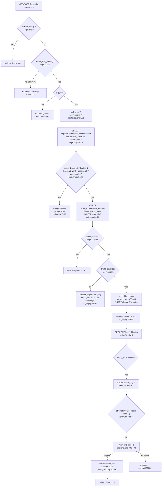
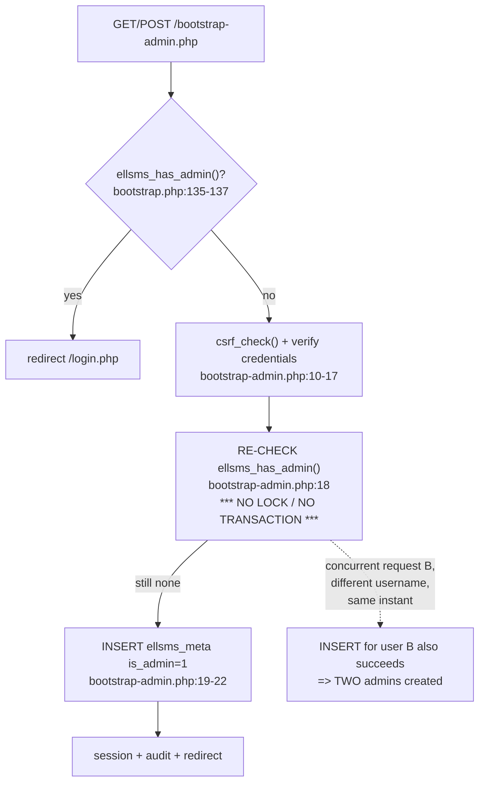

# Auth, 2FA, bootstrap-admin, user/KYC management

## Login + 2FA



## bootstrap-admin.php race



## User management / KYC admin edit

```mermaid
flowchart TD
    A["/users.php"] --> B["require_admin()"]
    B --> C{"POST?"}
    C -->|yes| D["csrf_check()"]
    D --> E{"do=?"}
    E -->|grant| F["lookup by username, INSERT/UPDATE ellsms_meta"]
    E -->|revoke / toggle_admin<br/>(self-check present)| G["UPDATE ellsms_meta<br/>*** id !== me only ***"]
    E -->|toggle_2fa / originator /<br/>credit / password / kyc_save<br/>(NO self-check, NO existence check)| H["UPDATE ellsms_meta / user_ / ellsms_user_kyc<br/>WHERE id = $id<br/>*** never checked against panel_access=1 ***"]
    E -->|create_account| I["backend_create_account() POST /api/users/"]
    I -->|201| K["INSERT ellsms_meta<br/>*** not transactional with API call ***"]
    C -->|no, GET| N{"$_GET[edit] set?"}
    N -->|yes| O["SELECT u.*,m.* FROM user_ LEFT JOIN ellsms_meta<br/>WHERE u.id = $_GET[edit]<br/>*** NO WHERE panel_access=1 ***<br/>=> any user_ row in shared DB loadable"]
    N -->|no| Q["SELECT panelUsers WHERE panel_access=1 (correctly scoped)"]
```

External dependencies: `app/bootstrap.php` (db, current_user, csrf, backend_hash/verify_password, kyc_store_upload), `app/backend.php` (send_2fa_code, verify_2fa_code, backend_create_account).
