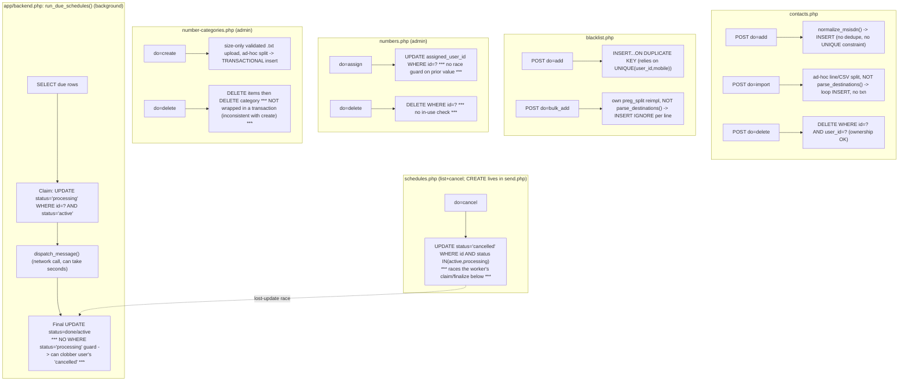

# Contacts, blacklist, numbers, number categories, schedules

External dependencies: `app/bootstrap.php` (parse_destinations — NOT reused by contacts/blacklist/number-categories's own importers), `app/backend.php` (run_due_schedules, dispatch_message).
