# Payments (ZarinPal) — full purchase -> callback -> credit flow

```mermaid
flowchart TD
    A["POST /buy-credit.php"] --> B["csrf_check()"]
    B --> C["credits = max(0, POST['credits'])"]
    C --> D{"credits < minPurchase? (no MAX bound exists)"}
    D -- no --> E["amountRial = credits * rialPerCredit (trusted setting, not client input)"]
    E --> F["INSERT ellsms_payments status=pending"]
    F --> G["zarinpal_request()"]
    G --> H{"code==100?"}
    H -- yes --> I["UPDATE authority=?"]
    I --> J["redirect to ZarinPal StartPay"]
    J --> K["User pays"]
    K --> L["GET /zarinpal-callback.php?payment_id&Authority&Status"]
    L --> M["SELECT payment WHERE id=?"]
    M --> N{"row exists AND user_id==me?"}
    N -- yes --> O{"authority matches Authority param?"}
    O -- yes --> P{"status already 'paid'?"}
    P -- no --> Q{"Status==OK?"}
    Q -- yes --> R["zarinpal_verify() — treats code 100 AND 101 (already-verified) as ok=true"]
    R --> S{"verify ok?"}
    S -- yes --> T["ATOMIC CLAIM:<br/>UPDATE ellsms_payments SET status='paid' WHERE id=? AND status='pending'<br/>*** keys on id (PK), not authority as README claims — functionally fine, doc mismatch ***"]
    T --> U{"rowCount()>0?"}
    U -- yes --> V["UPDATE user_ SET currentcredit += credits<br/>*** NOT in same transaction as T ***<br/>crash here = payment marked paid forever, credit never applied, NO reconciliation job"]
    V --> W["audit + success message"]
```

Verified solid: double-credit guard (atomic CAS on `id`), ZarinPal verify idempotency (100/101 both accepted), ownership + authority-echo integrity check, CSRF, no client-tamperable amount.

Real gaps: no transaction spanning payment-row claim + credit increment (finding of highest severity in this flow); no upper bound on purchase size; no reconciliation job for abandoned/never-returned payments (`cron/worker.php` has zero payment-related code).

External dependencies: `app/zarinpal.php`, `app/bootstrap.php` (setting/env, csrf, current_user).
