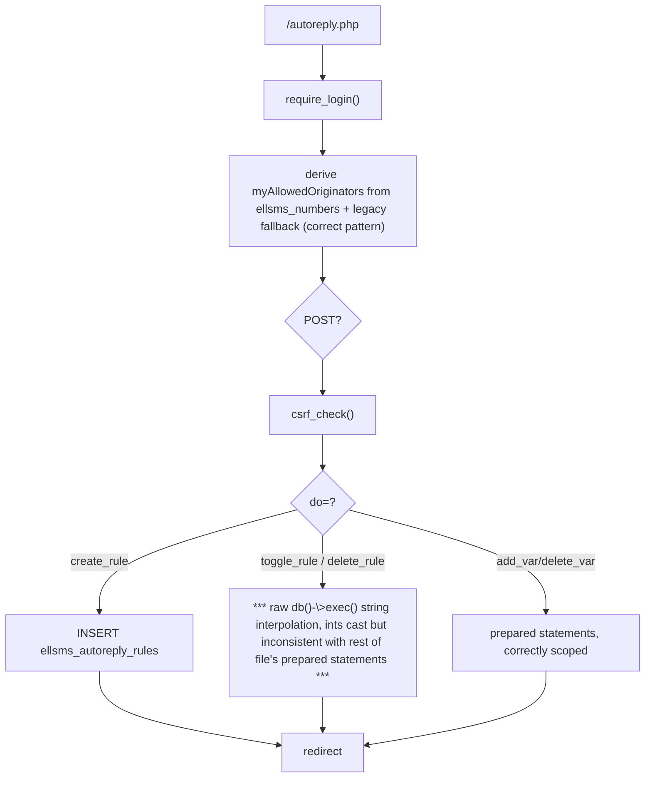
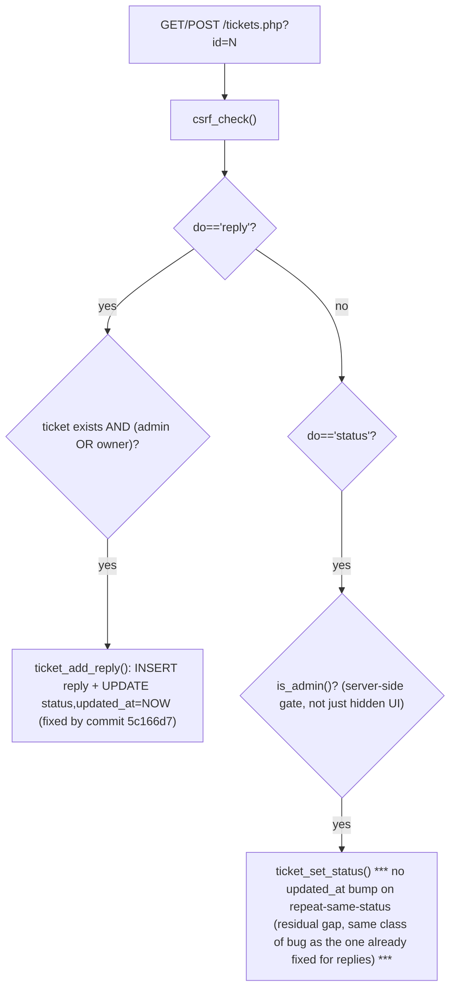
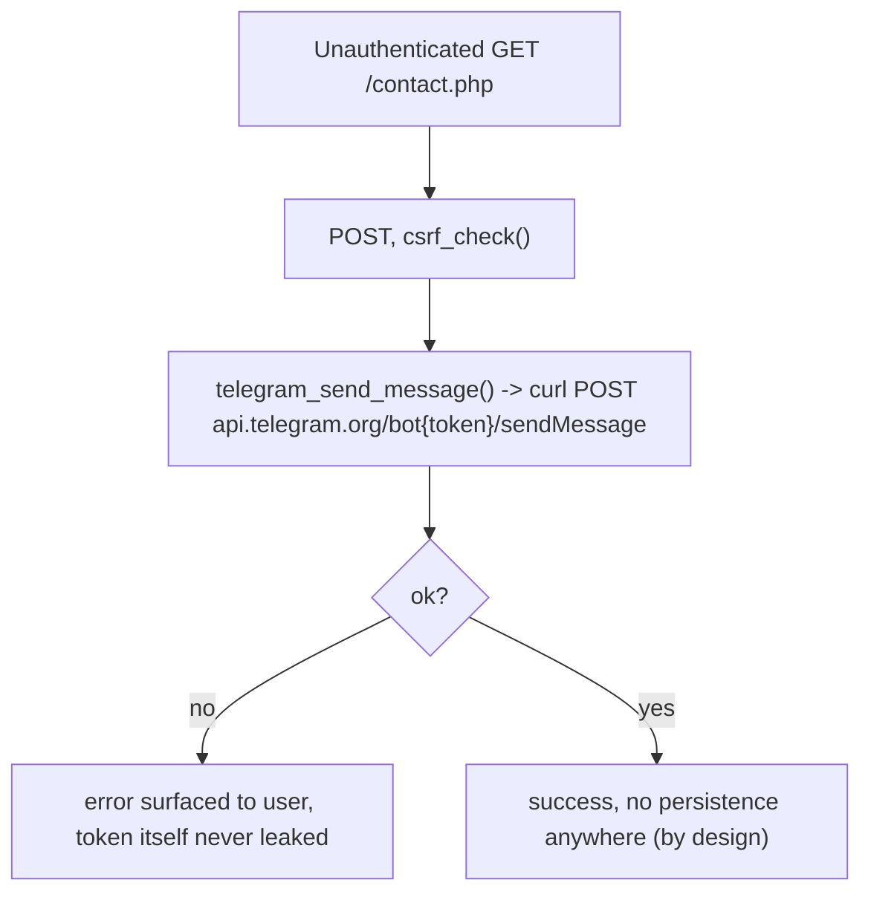

# Inbox/reports/analytics/autoreply UI + tickets + public site + Telegram relay

## inbox.php — confirmed IDOR / cross-tenant leak

```mermaid
flowchart TD
  A["/inbox.php"] --> B["require_login()"]
  B --> C["parse filters"]
  C --> G{"is_admin()?"}
  G -->|no AND me.originator != ''| H["where += destination = me.originator"]
  G -->|no AND me.originator == '' (the common case on installs using ellsms_numbers)| I["*** NO OWNERSHIP FILTER — sees ALL inbound rows for every user/line, incl. content ***"]
  H --> J["SELECT ... LIMIT 50"]
  I --> J
```
Root cause: `ellsms_meta.originator` is a legacy single-line fallback (schema comment, db/ellsms_extra.sql:148-150); the real per-user scope lives in `ellsms_numbers`, which `inbox.php` never queries — unlike `autoreply.php` (queries ellsms_numbers correctly) and `reports.php` (scopes by `sender_user_id` FK correctly).

## autoreply.php admin UI


Note: worker (`autoreply_process_one`, backend.php:264) only evaluates the first 20 active rules per line — a 21st rule is silently dead with no UI warning.

## reports.php / analytics.php (read-only)

- `reports.php` scopes correctly by `sender_user_id` (FK, correct pattern).
- `analytics.php` (admin-only) pulls up to 300,001 full rows including `content` TEXT into PHP memory, then aggregates in PHP instead of SQL `GROUP BY` — real perf/memory cost per page load on a large shared table.

## Ticket thread / reply


Everything else here is solid: IDOR checks present on every mutation, CSRF present, all output escaped via `e()`/`nl2br(e())`.

## Contact form -> Telegram relay


Gap: no rate limiting/CAPTCHA — a scripted client that fetches a CSRF token first can spam the configured Telegram chat freely.

## Public marketing pages (landing/pricing/guide/slides)

Admin CRUD (`pricing.php`, `guide-admin.php`, `slides.php`) each hand-roll a near-identical save/delete/toggle dispatch + list-table pattern — see duplication report. `slides.php`'s upload validator lacks the extension-fallback that `kyc_store_upload()` has, an inconsistency between two structurally-identical helpers.
