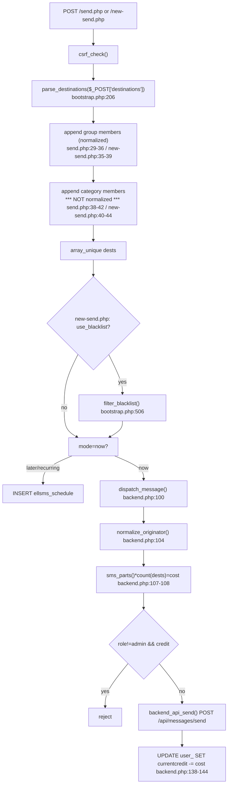
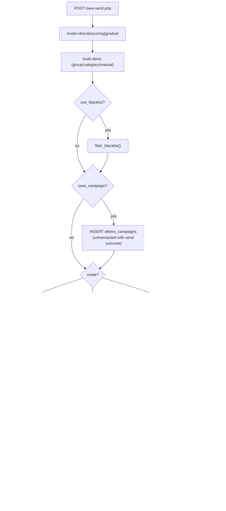
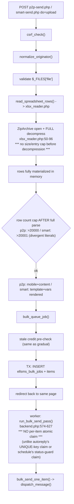
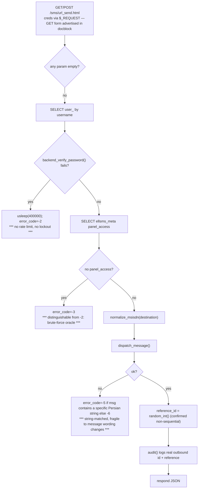

# Send / new-send / bulk (p2p, smart, gradual) / legacy URL API

## Direct send

## new-send.php — 3 modes (direct / recurring / gradual)

## p2p / smart upload -> queue -> worker

## Legacy url_send.html

External dependencies: `app/backend.php` (dispatch_message, bulk_queue_job, bulk_send_one_item, run_bulk_send_pass), `app/bootstrap.php` (normalize_msisdn, normalize_originator, parse_destinations, sms_parts, filter_blacklist), `app/xlsx_reader.php`.
