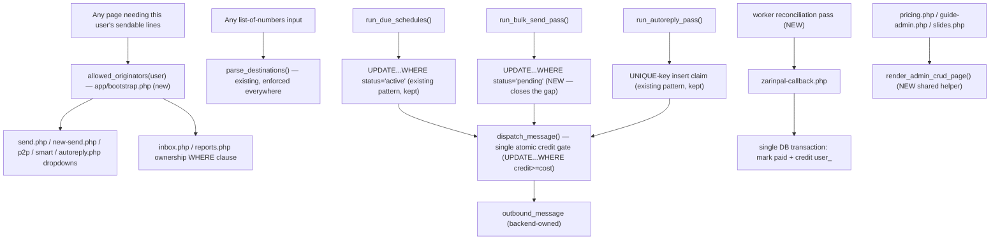

# Unified proposal — FUTURE PHASE ONLY, NOT ACTION TO TAKE NOW

Everything in this document is a recommendation for a later, deliberately-scoped refactor phase.
Nothing here should be implemented as a side effect of the current stabilization pass. STEP 1
was analysis only; this section exists so the analysis isn't thrown away once STEP 2 begins.

## Proposed consolidations

### A. One "resolve this user's allowed originators" function
Single entry point: `allowed_originators(array $user): array` in `app/bootstrap.php`, returning the
`ellsms_numbers` set for that user with the legacy `ellsms_meta.originator` fallback folded in —
the exact logic `autoreply.php:9-17` already has right. Every call site that currently does its
own `SELECT number,label FROM ellsms_numbers WHERE assigned_user_id=?` (5 sites, see duplication
report #1) and `inbox.php`'s broken ownership filter (which never queries `ellsms_numbers` at all)
would call this one function instead. This is the single highest-value consolidation because it's
also the fix for the confirmed IDOR in `inbox.php`.
Old call sites become: `$originators = allowed_originators($me);` then reuse the returned list both
for the send-page dropdown and for the inbox/reports WHERE-clause scoping.
Loss of capability: none.

### B. One "parse a list of numbers" entry point (already exists — just enforce its use)
`parse_destinations()` (`app/bootstrap.php:206`) already does everything `contacts.php`,
`blacklist.php`, and `number-categories.php` reimplement ad hoc (duplication report #4).
Old call sites (`contacts.php:22-34`, `blacklist.php:23-32`, `number-categories.php:22-28`) become
a single `parse_destinations($raw)` call; `contacts.php`'s `name,mobile` per-line case is the one
genuine variant and would stay a thin wrapper around it, not a full reimplementation.
Loss of capability: none — behavior should converge to the already-normalized, already-deduped
version, which is strictly more correct than any of the three current copies.

### C. One worker-claim pattern, not three
Standardize every worker pass on the `run_due_schedules()` claim shape (`UPDATE ... SET
status='processing' WHERE id=? AND status='<prior>'`, checked via `rowCount()`), since it's the
simplest of the two safe patterns already in the codebase (autoreply's UNIQUE-key-insert claim is
equivalent in safety but heavier). Add the missing per-item claim to `run_bulk_send_pass()`
(duplication report #5) using this same shape — e.g. an `UPDATE ellsms_bulk_items SET
status='claimed' WHERE id=? AND status='pending'` immediately before `bulk_send_one_item()` sends.
Loss of capability: none — this closes the one real gap (bulk has no claim today) rather than
changing behavior of the two passes that already do this correctly.

### D. One credit-check-and-deduct path, made atomic
Replace the read-then-compare-then-update pattern in `dispatch_message()` (`backend.php:110-112,
138-144`) with a single atomic conditional statement, e.g.
`UPDATE user_ SET currentcredit = currentcredit - ? WHERE id = ? AND currentcredit >= ?` checked
via `rowCount()`, and delete `bulk_queue_job()`'s duplicate upfront check (`backend.php:503-505`)
entirely — let every path (direct, scheduled, bulk, autoreply, 2FA) go through the one atomic
gate inside `dispatch_message()`/`bulk_send_one_item()` and surface "insufficient credit" as a
per-item failure rather than a pre-flight estimate. This closes the TOCTOU race without adding
row-level locking complexity.
Loss of capability: bulk uploads lose the "reject the whole batch upfront if it obviously can't
afford it" UX — acceptable trade, and could be kept as a non-authoritative early warning as long
as it's clearly not the enforcement point.

### E. Wrap the payment-callback credit grant in a transaction, and add a reconciliation pass
`zarinpal-callback.php:40-44` — wrap the `ellsms_payments` claim UPDATE and the `user_.currentcredit`
increment in one `db()->beginTransaction()`/`commit()`. Additionally, add a scheduled reconciliation
check (could piggyback on the existing worker loop) that re-queries ZarinPal's `verify` endpoint for
any `ellsms_payments` row still `pending` after N minutes, so a customer who never returns to the
callback URL isn't permanently uncredited.
Loss of capability: none.

### F. One admin-CRUD scaffold for the marketing-content pages
`pricing.php`, `guide-admin.php`, `slides.php` (duplication report #7) become thin config objects
(table name, editable columns, optional upload handler) passed into one shared
`render_admin_crud_page()` helper, rather than three copies of save/delete/toggle/list.
Loss of capability: none, provided the upload-handling variant (slides) is supported as an
optional hook rather than assumed absent.

### G. Split the largest files along the boundaries already visible in the findings
- `app/backend.php` (627 lines) → separate the API client (`backend_api_send`,
  `backend_create_account`, `describe_api_error`) from the three worker passes (schedules,
  autoreply, bulk) and from 2FA. They already read as distinct sections with clear seams; this is
  a mechanical split, not a redesign.
- `public/users.php` (382 lines, 10-way `$do` dispatch) → factor a single "resolve + authorize
  target user" gate that every `id`-scoped action goes through before its own logic, closing the
  inconsistency where 2 of 6 actions self-check `id !== me` and 4 don't (see Batch A finding 9).
- `app/bootstrap.php` (520 lines) → the Jalali calendar block (100+ lines) and KYC upload
  validation are self-contained and could move to their own files purely for navigability; no
  behavior change implied.

## Combined proposed flow (illustrative — future state)

## Anti-patterns deliberately avoided in this proposal
- No new abstraction layer "for flexibility" — every consolidation targets a function that already
  exists (`parse_destinations`, `current_user`'s join shape) or a pattern already proven safe
  elsewhere in the same codebase (the schedule claim).
- No feature flags keeping old and new send-page wiring both alive — the p2p/smart page
  duplication (duplication report #3) should be deleted, not toggled.
- No registry/factory for the admin-CRUD scaffold — a plain config array + one function is enough
  for 3 call sites.
- No speculative generalization beyond what 6 subagents + orchestrator actually found duplicated.
