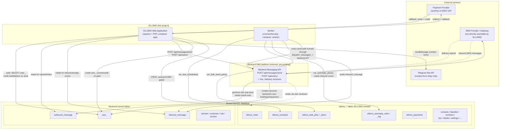

# ELLSMS — Architecture

This document describes the architecture of ELLSMS **as it exists today**. It is a factual
snapshot, not a target design — see `PATHFINDER-2026-07-26/03-unified-proposal.md` for
forward-looking recommendations, which are explicitly out of scope for this document.

ELLSMS is a self-hosted SMS panel (PHP 8.2, no framework, no `vendor/`) that deliberately does
**not** own its own user database or talk to an SMS gateway directly. It attaches to the Docker
network and MySQL database of an external, pre-existing "backend" SMS platform, authenticates
against that platform's own accounts, and sends messages by calling that platform's own REST API
— never the underlying gateway. This single design decision (share the DB, call the backend's
API, don't duplicate anything the backend already owns) shapes almost everything below.

## Components

### ELLSMS Web Application
Plain PHP 8.2, served by Apache from `public/` (Apache document root). No MVC framework — each
page under `public/*.php` is a self-contained controller+view that starts with `require_once
app/bootstrap.php`, calls `require_login()`/`require_admin()`, does its own validation and SQL via
a shared `PDO` singleton (`db()`), and renders HTML inline (shared chrome in
`app/views/header.php`/`footer.php` for the logged-in app, `public_header.php`/`public_footer.php`
for the public marketing site). Session-based auth with `ELLSMS_SESSION` cookie, CSRF tokens on
every state-changing form. Runs in the `app` container (`docker-compose.yml`).

Covers: login/2FA, send (direct, combined "new-send" panel, bulk p2p/smart, legacy URL API),
contacts/blacklist/numbers/number-categories, schedules, auto-reply rule management, inbox/reports/
analytics, KYC/profile/users/settings, buy-credit, tickets, and the public marketing site
(landing/pricing/guide/slides/contact).

### ELLSMS Database Tables
Everything ELLSMS owns lives in the same physical MySQL database as the backend platform, but is
namespaced under an `ellsms_` prefix specifically so it can never collide with the backend's own
schema, now or after a future migration on the backend's side. Defined in `db/ellsms_extra.sql`,
applied idempotently (`CREATE TABLE IF NOT EXISTS`, guarded `ALTER TABLE` migrations checked
against `information_schema`). No foreign keys point at backend-owned tables — cross-references
(e.g. `ellsms_meta.user_id`) are plain columns, not FK constraints, since ELLSMS doesn't consider
itself the owner of referential integrity on the other side.

| Table | Purpose |
|---|---|
| `ellsms_meta` | Per-user ELLSMS panel access, admin flag, legacy single-originator fallback, 2FA toggle |
| `ellsms_settings` | Key/value config (API base URL, ZarinPal, Telegram, credit pricing) — overrides `.env` |
| `ellsms_schedule` | Scheduled & recurring send definitions |
| `ellsms_contacts` | Per-user contact list/groups |
| `ellsms_blacklist` | Per-user do-not-contact list |
| `ellsms_numbers` | Sender-line pool, each assignable to one user |
| `ellsms_number_categories` / `_items` | Admin-managed, globally shared number lists |
| `ellsms_autoreply_rules` / `_variables` / `_log` | منشی پیامک auto-responder engine + audit trail |
| `ellsms_2fa_codes` | SMS-based login 2FA codes |
| `ellsms_user_kyc` | KYC profile fields + document photo filenames (files stored outside webroot) |
| `ellsms_bulk_jobs` / `_items` | Queued bulk sends (p2p / smart / gradual) processed by the worker |
| `ellsms_campaigns` | Saved sender+message templates |
| `ellsms_payments` | ZarinPal purchase records (pending/paid/failed) |
| `ellsms_slides` / `_pricing_packages` / `_guide_articles` | Public marketing site content |
| `ellsms_tickets` / `_ticket_replies` | In-panel authenticated support tickets |
| `ellsms_audit_log` | Cross-cutting action audit trail |

### Existing Backend Database Tables
Owned entirely by the external backend platform. ELLSMS reads and, in a small number of
documented places, writes to these — but never creates, migrates, or renames them, and has no
say over their schema (including indexing, which matters for `inbound_message`/
`outbound_message` — see the STEP 1 audit for where missing indexes are suspected but can't be
confirmed from this repo).

| Table | ELLSMS's relationship to it |
|---|---|
| `user_` | Read for auth (username/password/active/deleted/mobile); `currentcredit` is read every request and is the one column ELLSMS writes directly outside the backend API (credit deduction on send, credit increment on paid purchase, admin credit edit) |
| `domain`, `customer`, `role`, `access` | Referenced only indirectly (a domain must already exist for account creation; ELLSMS doesn't create/edit these) |
| `outbound_message` | Written by the **backend API**, not ELLSMS, as the result of a send — ELLSMS reads it back for reports/analytics. One documented exception: if the backend API is unreachable, ELLSMS writes its own `status='send_failed'` fallback rows directly so the failed attempt is still visible |
| `inbound_message` | Written by the backend platform's own `/mo` receiver — ELLSMS only ever reads it (inbox, auto-reply engine's scan cursor) |

### Backend Messaging API
An external REST API (`{API_BASE_URL}`, configured via `.env`/Settings) belonging to the backend
platform. ELLSMS's `app/backend.php` is a thin client over it:
- `POST /api/messages/send` — the single choke point for actually sending a message
  (`backend_api_send()`, called by `dispatch_message()`). The API performs the real gateway call
  and writes the resulting `outbound_message` rows; ELLSMS reads them back from the HTTP response.
- `POST /api/users/` — account creation, so the backend's own password hashing and uniqueness
  rules apply instead of ELLSMS guessing at them (`backend_create_account()`).

### SMS Provider/Gateway
Not directly reachable from ELLSMS at all. The backend platform's own REST API is the only thing
that talks to the actual gateway; delivery reports and inbound (MO) messages arrive through the
backend's own `/delivery` and `/mo` receiver endpoints, straight into the shared
`outbound_message`/`inbound_message` tables. ELLSMS has no webhook of its own for either.

### Worker
`cron/worker.php`, running in its own `worker` container (built from the same image as `app`).
An infinite loop, 8-second tick, three independent passes each in their own try/catch so one
failing pass doesn't block the others:
1. `run_due_schedules()` — dispatches due scheduled/recurring sends
2. `run_autoreply_pass()` — scans new `inbound_message` rows, matches auto-reply rules, replies
3. `run_bulk_send_pass()` — sends a batch of any queued bulk job (p2p / smart / gradual)

Can also run once via `php cron/worker.php --once` for external cron instead of the persistent
loop — the two invocation modes are not mutually exclusive at the code level, so running both
against the same install at once is a latent double-processing risk (see STEP 1 audit).

Phase 9 instrumented the loop and every claim path with lightweight metrics (`app/Support/Metrics.php`
— structured log lines, no external monitoring agent) and added two on-demand operational commands,
`make jobs-status` and `make performance-snapshot`, plus a reproducible load-test harness
(`cron/load-test.php`) — see `docs/observability-and-performance.md`.

### Payment Provider
ZarinPal (Iranian payment gateway), v4 REST API, integrated in `app/zarinpal.php`. Unit is always
Rial. Flow: `buy-credit.php` creates a `pending` `ellsms_payments` row and redirects to ZarinPal;
`zarinpal-callback.php` verifies the payment and, on success, atomically flips the row to `paid`
and credits `user_.currentcredit`. Not a component ELLSMS embeds — it's an external hosted
checkout the user is redirected to and back from.

## Architecture diagram



## Ownership summary — at a glance

- **ELLSMS owns:** every `ellsms_*` table, `docker/`, `app/`, `public/`, `cron/worker.php`,
  `db/ellsms_extra.sql`. Freely modifiable, no coordination needed.
- **Backend platform owns:** `user_`, `outbound_message`, `inbound_message`, `domain`, `customer`,
  `role`, `access`, and the entire messaging/gateway pipeline behind its REST API. ELLSMS treats
  these as read-mostly, with one narrow, deliberate exception: `user_.currentcredit` (the legacy
  credit-projection compatibility write, `app/Backend/credit_projection.php` — see
  `docs/service-boundaries.md`). Phase 8 removed the older `outbound_message` fallback-write
  behavior this section used to describe: an unreachable backend API is now recorded only in
  ELLSMS's own `ellsms_message_attempts` table, never fabricated into the backend-owned table (see
  `docs/service-boundaries.md` §7, Invariant E). Every `user_`/`domain`/`inbound_message`/
  `outbound_message` access from ELLSMS code funnels through `app/Backend/*` and is enforced by
  `make backend-boundary-check`. Any schema change to backend-owned tables (new columns, new
  indexes, constraints) requires coordinating with whoever operates that platform — it is out of
  ELLSMS's control and out of this repo entirely.

## Production hardening (Phase 10)

Trusted-proxy configuration (`TRUSTED_PROXY_IPS`), production configuration validation
(`make config-check`), and the full pre-deploy/smoke-test/release-check/production-integrity-check
operational command set live in `docs/production-hardening.md` — including the honest, still-PARTIAL
status of the backend HMAC verifier (client-side signing exists in this repo; no backend-side
verifier does). See `docs/phase-10-final-report.md` for the production-readiness decision.

## Backup, restore & disaster recovery (Phase 11)

`cron/backup.php` (`mysqldump --single-transaction`, optional gpg encryption, checksummed JSON
manifest) backs up the **complete** shared database, not just `ellsms_*` tables — see
`app/Backup.php`'s own docblock and `docs/backup-and-disaster-recovery.md` §1 for why a partial
backup would be useless for this shared-database architecture. Restore
(`cron/restore.php`/`cron/restore-test.php`) is safe-by-default (always creates a fresh database
unless explicitly told to overwrite one, which additionally requires `ALLOW_DESTRUCTIVE_RESTORE=1`
+ an exact-name confirmation) and **CLI-only** — there is no web-reachable restore action anywhere
in `public/`, enforced by a static test. `cron/dr-drill.php` composes the whole toolchain into one
timed real disaster-recovery rehearsal (backup → simulated total loss → restore → integrity checks
→ a live throwaway app server + smoke test → a real worker pass), guarded so it can never target a
non-test-named database by default.

Operator-controlled maintenance mode (`app/maintenance.php`) is a plain file flag under `storage/`
— `app` and `worker` already bind-mount the same host directory, so toggling it takes effect in
both containers instantly with no restart. Health/readiness and the ZarinPal payment callback stay
reachable during maintenance by explicit design; every CLI operational command in this phase is
entirely unaffected by it (checked via `PHP_SAPI !== 'cli'`), since an operator needs those tools to
keep working DURING the exact maintenance window they exist for.

`cron/release.php` composes the existing validation tools (predeploy-check, backup, backup-verify,
production-integrity-check) into a three-mode release helper (`--check`/`--plan`/`--apply`) and
records release metadata — it does not deploy code or apply migrations itself, since this repo has
no CI/CD pipeline for it to hand either off to. See `docs/production-runbook.md` for the full
15-step release sequence and the per-migration rollback classification for every migration this
project has ever shipped. See `docs/backup-and-disaster-recovery.md` for the full backup/restore/
DR reference and `docs/phase-11-final-report.md` for the production-readiness decision.

## Public API & webhooks (Phase 12)

A versioned public API (`public/api/index.php`, `/api/v1/*`) sits beside the existing web-session
panel and the internal backend-platform HMAC scheme — three completely independent authentication
layers, sharing no key material (Invariant L). `app/ApiKeys.php` owns key generation/hashing/
lifecycle (SHA-256 verifier, never Argon2id — see its own docblock for why that's the deliberate,
correct tradeoff for a high-entropy machine secret rather than a human password);
`app/Support/ApiScopes.php` is the scope catalog; `app/Idempotency.php` implements the
Idempotency-Key lock/replay primitive on a real `UNIQUE` DB constraint (not an in-process cache);
`app/Webhooks.php` owns endpoint CRUD, fail-closed SSRF URL validation, AES-256-GCM secret envelope
encryption, event outbox/fan-out, and HMAC-SHA256 signing. Every API write endpoint reuses the
EXACT existing domain services (`dispatch_message()`, `bulk_queue_job()`, `wallet_balance()`) —
Phase 12 adds no parallel financial or messaging logic (Invariant K).

`cron/webhook-worker.php` is a dedicated worker/container, deliberately separate from
`cron/worker.php` (a slow customer endpoint must never delay an SMS send), reusing the exact same
atomic claim/lease/retry shape Phase 4 established for bulk items. The public API and webhook
system are both **off by default** (`API_ENABLED=0`) — see `docs/public-api.md`,
`docs/webhooks.md`, and `docs/phase-12-final-report.md` for the full reference and
production-readiness decision.

## Plans, subscriptions & entitlements (Phase 13)

A SaaS control plane sits beside — never inside — the existing authorization layers. Phase 7's RBAC
answers "may this USER act?", Phase 12's API scopes answer "may this KEY call this?", and Phase 13's
entitlements answer "does this ORGANIZATION'S SUBSCRIPTION include this at all?" All three are
evaluated independently and all three must pass: an owner cannot bypass a plan limit, a paid plan
grants no permission, and platform administration (`ellsms_meta.is_admin`) is never governed by any
customer's plan.

`app/Support/Entitlements.php` and `app/Support/Limits.php` are the central catalogs (same
fail-closed discipline as `Permissions`/`ApiScopes` — an unknown key always denies). `app/Billing.php`
owns the plan catalog and the subscription state machine; `app/Entitlements.php` is the single
decision service the web UI, the public API, and the workers all call — there is no second copy of
any rule anywhere.

Two structurally different enforcement mechanisms, both genuine database guarantees rather than
application conventions: usage meters (messages) use a single atomic conditional UPDATE
(`SET reserved = reserved + N WHERE ... AND (used + reserved + N) <= limit`), and resource counts
(API keys, contacts, members, ...) use `entitlement_with_resource_slot()`, which holds a row lock on
the organization across the count and the caller's INSERT. "At most one effective subscription per
organization" is likewise enforced by the database itself, via a generated column plus a UNIQUE index
— a raw INSERT bypassing the application cannot violate it.

Quota reservation mirrors the Phase 3 wallet reservation exactly, keyed on the same
`(reference_type, reference_id)`, so worker retries replay rather than double-consume. Subscription
payments reuse the Phase 3 payment machinery through a `purpose` discriminator on `ellsms_payments`,
never crediting the wallet, with the amount always derived server-side into an immutable
`ellsms_billing_records` snapshot.

The whole subsystem is **off by default** (`BILLING_ENABLED=0`) and writes no rows in that state —
see `docs/plans-and-entitlements.md`, `docs/billing-operations.md`, and
`docs/phase-13-final-report.md`.

## Pre-send cost preview

`app/Cost/MessageCostEstimator.php` is the single estimator behind every cost preview surface (the
direct-send page, the combined send panel, and `POST /api/v1/messages/preview` /
`POST /api/v1/bulk-jobs/preview`). It is read-only by construction: it calls `sms_parts()`,
`normalize_msisdn()`, `filter_blacklist()`, `can_use_originator()`, `wallet_balance()` and
`organization_usage()` — every one of them the same function the real send path already uses, and
none of them a writer. That is what makes "the preview and the charge can never disagree" true by
construction rather than by convention; a unit test additionally asserts the estimator's segment
count is always identical to `sms_parts()`.

Pricing itself is no longer the estimator's own rule — it delegates to the SMS pricing engine below.

A preview is an estimate, never a reservation: it holds nothing, so a balance or quota consumed
between preview and confirmation is caught by the send path's existing atomic re-check rather than
by the preview. See `docs/cost-preview.md`.

## SMS pricing (operators, providers, routes, tariffs)

`app/Sms/Pricing.php` is the ONE pricing engine. It replaced a literal `sms_parts($content) *
$count` — "1 credit per segment" — that had been duplicated across `dispatch_message()`,
`dispatch_message_retryable()`, `bulk_queue_job()` and the cost estimator with no way for an operator
to change it. All four now call `sms_pricing_price_messages()`, which is what keeps preview and
charge identical by construction.

Resolution is a chain of lookups, never a comparison:

```
phone -> normalize -> longest configured prefix -> OPERATOR
sender + server-decided message type -> explicit assignment or the single default -> ROUTE -> PROVIDER
(route, operator) + UTC instant -> effective-dated TARIFF -> unit price -> cost
```

Seven ELLSMS-owned tables hold the catalog (`ellsms_sms_operators`, `..._operator_prefixes`,
`..._providers`, `..._routes`, `ellsms_sender_routes`, `..._route_prices`, `..._price_snapshots`),
all admin-managed from **مدیریت → تعرفه‌ی پیامک** behind the platform-admin guard — never an
organization permission, because these are global rates.

Load-bearing properties:

- **No smart routing, no failover, no health/price comparison.** Route selection is explicit and
  deterministic; ambiguity is prevented by unique indexes and reported by the integrity check.
- **Money is integer millicredits** (1 credit = 1000), rounded to whole credits once per message.
  No float participates in a cost computation; the wallet stays credit-denominated.
- **Fails closed.** An unpriceable recipient refuses the send rather than being charged a guessed
  rate — with one explicit, admin-visible, admin-disableable legacy fallback (1 credit/segment) that
  exists so applying the migration to an existing install cannot cause an outage.
- **Configuring a provider changes no transport.** Gateway credentials remain entirely in
  `app/Backend/ApiClient.php` + `BACKEND_*`; this catalog is pricing metadata only.
- **Accepted prices are immutable.** Each acceptance writes `ellsms_sms_price_snapshots` rows (one
  per route/operator/rate group); settlement updates only the settled columns. Historical cost
  reporting reads snapshots and never recomputes from the current tariff tables, so an admin rate
  change cannot rewrite history. Bulk rows additionally carry their frozen price, so retries never
  re-price.

See `docs/sms-pricing.md`.

## Support impersonation

`app/impersonation.php` lets a platform administrator open a customer's panel for support, without
their password. Its whole design is one decision: **while impersonating, `$_SESSION['uid']` is the
TARGET's id**, so `current_user()`, `current_organization()` and every RBAC primitive resolve exactly
as they would in the customer's own session. There is no hybrid identity, and therefore no
platform-admin bypass to leak into a customer page — `is_admin()` is false and the admin area returns
403 until the operator exits.

The real actor is preserved beside it in the session and used for exactly three things: the banner
rendered on every authenticated page, the audit trail
(`ellsms_audit_log.impersonator_user_id`, populated automatically by `audit()`), and the exit control.

Support mode is read-mostly: one central deny-list blocks sending, credential changes, integration
secrets, billing/wallet mutations and destructive deletions, enforced server-side at the existing
choke points. Cost preview and all reading stay available. The feature lives entirely in `$_SESSION`,
so the public API and the workers are structurally unaffected by it.

See `docs/admin-impersonation.md`.

## Customer / organization profile

`app/Profile.php` owns the extended profile model, built on one rule: **personal identity belongs to
the user, company and legal data belongs to the organization.** Company data keyed by `user_id` would
make a second member of an organization unable to see the same company profile, and a user in two
organizations unable to see two different ones — so every company read/write takes an
`organization_id` and every personal one takes a `user_id`.

Five ELLSMS-owned tables: `ellsms_user_profiles`, `ellsms_organization_profiles`,
`ellsms_organization_addresses`, `ellsms_organization_notification_preferences`, and
`ellsms_profile_documents`. The backend platform stays authoritative for identity (username, name,
email, mobile, balance); none of it is copied and `app/Profile.php` contains no `user_` SQL at all.

Documents live outside the web root with opaque random names, are validated by real content
inspection, carry a database `CHECK` guaranteeing exactly one owner, and are reachable only through
`public/profile-document.php`, which authorizes every read and 404s on refusal. Replacement archives
rather than overwrites. Uploaded FILES are not part of the database backup — see TD-071.

Editing reuses `settings.manage` rather than minting new permissions. Support impersonation may read
a profile but never change one.

See `docs/customer-profile.md`.
