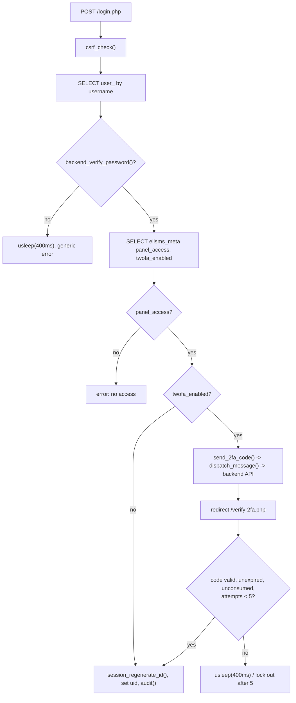

# Authentication (login, SMS 2FA, first-admin bootstrap, logout)

## Entry point
- `public/login.php` — GET renders the form, POST authenticates.
- `public/verify-2fa.php` — reached only via a redirect from `login.php` when the account has
  `ellsms_meta.twofa_enabled = 1`; requires `$_SESSION['twofa_uid']` to be set.
- `public/bootstrap-admin.php` — reachable at any time, but only does anything meaningful while
  `ellsms_has_admin()` is false (i.e. before the first ELLSMS admin exists).
- `public/logout.php` — GET, unconditional `session_destroy()`.

## Validation
- `login.php`: `csrf_check()` on POST; username looked up in `user_`; password checked via
  `backend_verify_password()` (`app/bootstrap.php:71`, SHA-256 over UTF-8 plaintext — the
  backend platform's own placeholder scheme, not something ELLSMS chose); account must be
  `active`, not `deleted`, and have `ellsms_meta.panel_access = 1`.
- `verify-2fa.php`: code must match `ellsms_2fa_codes` for the pending `twofa_uid`, be
  unconsumed, and not expired (3-minute TTL, `TWOFA_CODE_TTL_SECONDS` — shortened from 5 minutes
  in issue #5's re-audit to match the SLO spec's "OTP validity 3m"; see that constant's own
  comment in `app/bootstrap.php` for why this is a strictly safer change, not a weakened one);
  a per-session attempt counter is checked against a bare magic number (`5`, `verify-2fa.php:35`
  — not a named constant like its sibling TTL/cooldown values).
- `bootstrap-admin.php`: same password check as login, plus `ellsms_has_admin()` must be false
  both before showing the form and again immediately before the insert (see Race-condition
  risks below).
- `logout.php`: **no CSRF check** — the only state-changing action in the app without one.

## Database reads
- `user_` — `id, password, active, deleted` (+ `mobile` where 2FA is relevant) by `username`.
- `ellsms_meta` — `panel_access, twofa_enabled` (login), `is_admin`/existence (bootstrap-admin).
- `ellsms_2fa_codes` — lookup by `user_id, code, consumed=0, expires_at > NOW()`.
- `ellsms_has_admin()` — `SELECT COUNT(*) FROM ellsms_meta WHERE is_admin = 1`.

## Database writes
- `ellsms_2fa_codes` — INSERT a fresh 6-digit code (via `send_2fa_code()`, `app/backend.php:372`).
- `ellsms_2fa_codes.consumed = 1` on successful verify (`verify_2fa_code()`, `app/backend.php:406`).
- `ellsms_meta` — INSERT/UPDATE (`is_admin=1, panel_access=1`) on first-admin bootstrap.
- `ellsms_audit_log` — one row per successful login / 2FA verify / bootstrap-admin action.
- Session state (`$_SESSION['uid']`, `session_regenerate_id()` on every successful auth
  transition — correctly prevents session fixation).

## External API calls
- `send_2fa_code()` calls `dispatch_message()` (`app/backend.php:391`) which in turn calls the
  backend's `POST /api/messages/send` — i.e. 2FA code delivery goes through the exact same send
  path as a normal message, forced to `role='admin'` so it bypasses the credit check (see
  `docs/flows/credit.md` for why this particular bypass is a fragile pattern, not a bug).

## Failure paths
- Wrong username/password → generic error, fixed `usleep(400000)` delay, no account enumeration
  via the message text (but see Security concerns).
- Correct password, no `panel_access` → distinct error ("no panel access").
- No admin exists yet → any login attempt redirects to `/bootstrap-admin.php` instead.
- 2FA: wrong code → attempt counter increments, `usleep(400000)`; 5 wrong attempts → session
  cleared, forced back to `/login.php`. Expired/already-consumed code is treated as "no match."
- 2FA resend has a 60-second cooldown (`TWOFA_RESEND_COOLDOWN`), enforced from
  `$_SESSION['twofa_sent_at']`.

## Security concerns
- **Password hashing is a known-weak placeholder** (`backend_hash_password()`, plain SHA-256, no
  salt/stretching) — explicitly inherited from the backend platform, not fixable unilaterally on
  the ELLSMS side; tracked in `README.md`'s Production notes.
- **`logout.php` has no CSRF protection** — a third-party page embedding `` can force-terminate a victim's session (session DoS only, no data change).
- **2FA attempt counter is session-scoped**, not account/IP-scoped — clearing cookies resets it,
  so it slows but doesn't hard-stop a targeted attacker who can obtain fresh sessions.
- Anti-enumeration delay (`usleep(400000)`) is duplicated as an unnamed literal in three files
  (`login.php:17`, `verify-2fa.php:46`, `bootstrap-admin.php:16`) — a future change to this
  value requires editing all three in lockstep.
- The first-admin bootstrap page is reachable by anyone who knows any valid backend username and
  password until the first admin is created — by design (this is the intended flow for standing
  up the panel), but worth being aware that it's a live, unauthenticated-by-panel-role escalation
  path during the window before first setup.

## Race-condition risks
- **`bootstrap-admin.php` first-admin race (highest risk in this flow).** The re-check of
  `ellsms_has_admin()` immediately before the `INSERT INTO ellsms_meta` (`bootstrap-admin.php:18`)
  is not backed by any lock, transaction, or DB constraint — `ellsms_meta`'s only key is
  `user_id` (per-user), so nothing stops two concurrent requests for two *different* existing
  backend accounts from both passing the check and both becoming admin. See
  `PATHFINDER-2026-07-26/01-flowcharts/auth-2fa-admin.md` for the annotated diagram.
- No race risk identified in the normal login/2FA path itself — each request operates on its own
  session and the 2FA code table has no shared mutable state across concurrent logins for
  *different* users; a single user racing themselves (two tabs) at most produces two valid
  sessions, not a security boundary violation.

