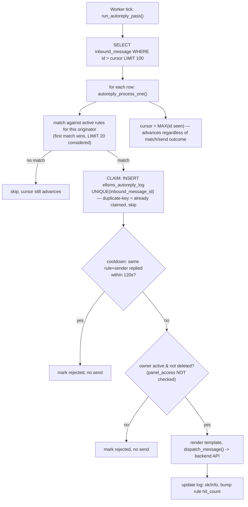

# Auto-reply engine (منشی پیامک)

Rule management is `public/autoreply.php` (authenticated UI); execution is a worker pass,
`run_autoreply_pass()` (`app/backend.php:224`), which scans `inbound_message` — a table ELLSMS
does not own and only ever reads.

## Entry point
- `public/autoreply.php` — CRUD for `ellsms_autoreply_rules`/`ellsms_autoreply_variables`,
  read-only view of `ellsms_autoreply_log`.
- `cron/worker.php` → `run_autoreply_pass()`, every 8-second tick.

## Validation
- Rule creation validates the originator against `allowed_originators` for the user (numbers
  they own via `ellsms_numbers`, plus the legacy `ellsms_meta.originator` fallback) and requires
  a non-empty keyword; `match_type` is constrained to `exact|starts_with|contains` (schema
  `ENUM`, also whitelisted in PHP before insert).
- Matching (`autoreply_matches()`) normalizes Persian/Arabic-Indic digits
  (`from_persian_digits()`) and lowercases both sides before comparing — so a keyword match is
  digit-form- and case-insensitive.
- **No cap enforcement at creation time** against the hardcoded `LIMIT 20` the matching query
  applies at runtime (`app/backend.php:264`) — a 21st active rule on the same line can be
  created with no warning and will silently never fire, since matching only ever considers the
  first 20 (ordered by match-type specificity, then `id`).

## Database reads
- `inbound_message WHERE id > ? ORDER BY id ASC LIMIT 100` — cursor-based, the cursor being
  `ellsms_settings.autoreply_last_inbound_id`.
- `ellsms_autoreply_rules WHERE originator = ? AND is_active = 1 ORDER BY FIELD(match_type,
  'exact','starts_with','contains'), id LIMIT 20` per inbound row.
- `ellsms_contacts` (contact name, for the `{name}` template variable) and
  `ellsms_autoreply_variables` (per-user custom `{var}` substitutions).
- `user_`/`ellsms_meta` — owner's `active`/`deleted`/`credit`/`is_admin` (**does not check
  `panel_access`**, same gap as the bulk engine — a revoked-access user's rules can still fire).

## Database writes
- **Claim, before sending anything:** `INSERT INTO ellsms_autoreply_log (rule_id,
  inbound_message_id, ...)` — protected by a `UNIQUE KEY` on `inbound_message_id`
  (`ellsms_autoreply_log`), so if two worker passes ever raced on the same inbound row, only the
  first `INSERT` succeeds; the second hits a duplicate-key `PDOException`, caught and treated as
  "already claimed, skip." This is the strongest concurrency-safety pattern of the three worker
  passes.
- `ellsms_autoreply_rules.hit_count = hit_count + 1` on a successful reply.
- `ellsms_autoreply_log` updated in place with the rendered reply, `ok` flag, and `info` message.
- `ellsms_settings.autoreply_last_inbound_id` — advanced to the max `id` seen **every pass,
  whether or not anything matched or sent successfully** (deliberate: this is the fix for a
  previously-real bug where an exception mid-row could leave the cursor stuck, causing the same
  row to be re-fetched and re-processed indefinitely — see the comment at `app/backend.php:241-246`).
- Credit deduction via `dispatch_message()`, same mechanism as every other send path — except the
  target user's role is passed through as whatever `is_admin` actually is (unlike 2FA, which
  force-overrides to `'admin'` to bypass the charge; an auto-reply genuinely charges the rule
  owner's credit like a normal send).

## External API calls
- `dispatch_message()` → `POST /api/messages/send`, once per matched-and-claimed inbound row.

## Failure paths
- A single bad row (malformed data, unexpected exception in matching/rendering) is caught
  per-row (`catch (Throwable $t)`) and logged via `error_log()` — it does **not** stop the
  cursor from advancing past that row, and does not stop the rest of the batch from processing.
- No matching rule for a given inbound message → row is skipped, cursor still advances (this is
  the normal, common case — most inbound messages won't match any keyword).
- Owner account inactive/deleted → claimed (so it won't be retried) but not sent, logged with a
  specific reason in `ellsms_autoreply_log.info`.
- Cooldown active (same rule replied to the same sender within `AUTOREPLY_COOLDOWN_SECONDS`,
  120s) → claimed, not sent, logged as rejected for that reason.

## Security concerns
- Reply templates (`{sender} {originator} {name} {date} {time} {keyword}` + custom `{var}`s) are
  rendered via plain `str_replace()` (`autoreply_render()`) with no escaping — this is fine
  because the output is an outbound SMS body, not HTML; the admin UI that *displays* rule/log
  data (`autoreply.php`) does correctly escape everything via `e()`, so there is no stored-XSS
  path from a contact name or custom variable value flowing back into a rendered page.
- `autoreply.php:50,56` (`toggle_rule`/`delete_rule`) build their `UPDATE`/`DELETE` via raw
  `db()->exec()` string interpolation rather than a prepared statement — both `$id` values are
  int-cast first so not currently exploitable, but it's the one inconsistency in an otherwise
  fully-parameterized file.

## Race-condition risks
- **This is the one worker pass with a genuinely safe concurrency design** — the
  INSERT-protected-by-UNIQUE-key claim means two overlapping worker passes (or a scaled worker)
  cannot both reply to the same physical inbound row. The separate cooldown check additionally
  guards against the *gateway* delivering the same physical SMS more than once (which would
  arrive as two distinct `inbound_message` rows with two distinct ids, so the UNIQUE-key claim
  alone can't catch that case — the cooldown is what does).
- The missing `panel_access` check on the rule owner (see Database reads) is not a race per se,
  but is the same class of staleness issue as the bulk engine's: revoking a user's panel access
  does not stop their already-active auto-reply rules from continuing to fire and charge credit
  until an admin also deactivates the rules or removes the numbers.

