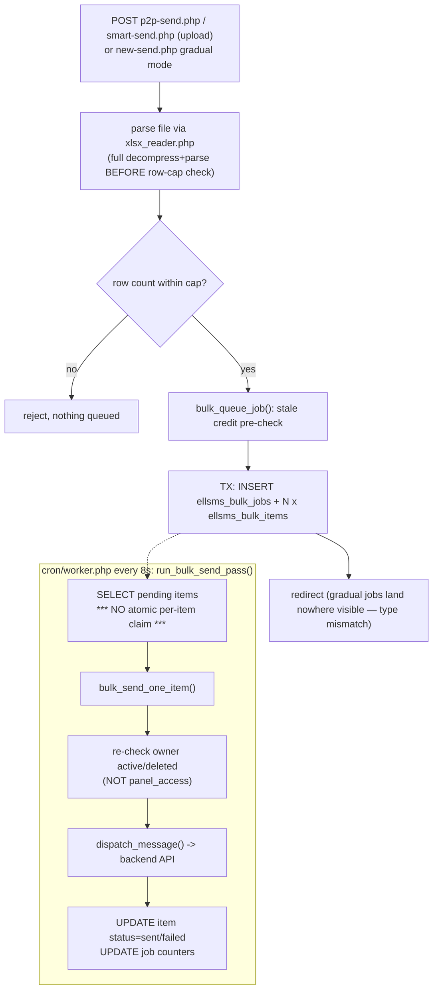

# Bulk message (p2p, smart, gradual)

Three UI entry points share one queue-and-worker engine: `public/p2p-send.php` (each row's full
message text supplied), `public/smart-send.php` (one template with `{column}` placeholders,
filled in per row), and `public/new-send.php`'s "gradual" mode (one message, throttled delivery
over time). All three resolve to plain `['mobile', 'content']` rows and call the same
`bulk_queue_job()` (`app/backend.php:494`); from that point on, the worker's
`run_bulk_send_pass()` (`app/backend.php:574`) doesn't know or care which page produced them.

## Entry point
- `public/p2p-send.php`, `public/smart-send.php` — authenticated POST with a `.xlsx`/`.csv` file
  upload.
- `public/new-send.php` gradual mode — authenticated POST, no file, one message fanned out to a
  destination list with `throttle_count`/`throttle_minutes`.
- Background continuation: `cron/worker.php` → `run_bulk_send_pass()`, every 8-second tick.

## Validation
- File presence/size checked before parsing; `normalize_originator()` on the originator field.
- Row cap enforced **after** the file is fully parsed into memory (`app/xlsx_reader.php` fully
  decompresses and `simplexml_load_string()`s the whole sheet before the caller ever counts
  rows) — `p2p-send.php:40` caps at 20,000 rows, `smart-send.php:42` at 20,001 (header + 20,000
  data rows) — same intent, divergent literal, no shared constant.
- Smart-send additionally validates that column C onward map to named template variables;
  unmatched `{placeholder}` tokens are left literal rather than blanked (a typo is visible, not
  silently dropped).
- `bulk_queue_job()` re-checks total cost vs. credit (`app/backend.php:503-505`) — see
  Race-condition risks, this is a duplicate of `dispatch_message()`'s check, not a replacement.

## Database reads
- `ellsms_numbers` (originator dropdown, same duplicated query as the direct-send pages).
- Worker: `ellsms_bulk_jobs`/`ellsms_bulk_items` for pending rows; `user_`/`ellsms_meta` per item
  to re-check the row's owner is still `active` and not `deleted` (**does not check
  `panel_access`** — a revoked-access user's already-queued items can still be sent after
  revocation, `app/backend.php:533-537`).

## Database writes
- Queue time (`bulk_queue_job()`, transactional): `INSERT ellsms_bulk_jobs` then one
  `INSERT ellsms_bulk_items` per row, wrapped in `beginTransaction()`/`commit()`/`rollBack()`.
- Worker (`bulk_send_one_item()`, per row, **not** transactional with the queue insert):
  `UPDATE ellsms_bulk_items SET status='sent'|'failed'` and the matching
  `ellsms_bulk_jobs.sent_rows`/`failed_rows` counter increment.
- `UPDATE user_ SET currentcredit = currentcredit - ?` inside `dispatch_message()`, once per
  item actually sent (same mechanism as direct send).
- `run_bulk_send_pass()` also flips `ellsms_bulk_jobs.status` `pending → processing → done` and
  stamps `last_throttle_at` for throttled (gradual) jobs.

## External API calls
- None at queue time. Each item, when the worker gets to it, goes through the exact same
  `dispatch_message()` → `POST /api/messages/send` path as a direct send.

## Failure paths
- Upload rejected (bad file, over row cap) → flash error, nothing queued, no credit touched.
- Item send fails → recorded per-row (`ellsms_bulk_items.status='failed'`, `error` message) and
  counted in `ellsms_bulk_jobs.failed_rows`; the job still completes (marked `done` once no
  pending rows remain) rather than aborting the whole batch.
- Owner account inactive/deleted by the time the worker reaches a row → item marked failed with
  a specific reason, no send attempted, no charge.
- A **`new-send.php` gradual job is queued with `type='gradual'` but the only listing/cancel UI
  (`p2p-send.php`) is hardcoded to `type='p2p'`** — the job is invisible and uncancellable from
  any page in the app once queued, even though it is actively being processed by the worker.

## Security concerns
- `app/xlsx_reader.php` decompresses (`ZipArchive`) and parses (`simplexml_load_string()`) the
  entire uploaded file **before** any row-count cap is applied — a small file with a
  highly-compressed `sharedStrings.xml` (classic zip-bomb ratio) or a sheet with millions of rows
  can exhaust memory/CPU during parsing, ahead of the cap that's meant to bound exactly that.
- Upload validation is size/extension-based only; no server-side content-type sniffing beyond
  what `ZipArchive`/`SimpleXML` naturally reject by failing to parse.

## Race-condition risks
- **`run_bulk_send_pass()` has no atomic per-item claim before sending** — it `SELECT`s pending
  rows and calls `bulk_send_one_item()` directly, unlike `run_due_schedules()` (claims via
  `UPDATE ... WHERE status='active'`) and `run_autoreply_pass()` (claims via an
  INSERT-protected-by-UNIQUE-key). If the worker ever overlaps itself — a long-running pass
  still in flight when the next tick starts, or `cron/worker.php --once` run alongside the
  persistent loop, or a worker container scaled to more than one replica — the same row can be
  selected and sent twice.
- **`bulk_queue_job()`'s upfront credit check uses an even staler snapshot** than
  `dispatch_message()`'s already-racy one: it's checked once at queue time against whatever
  `$user['credit']` was when the HTTP request started, and the actual enforcement doesn't happen
  again until the worker processes each item — possibly minutes or hours later. Two queue
  requests in quick succession (or one direct send plus one queue request) can each pass their
  own check while together exceeding the account's real balance; only the per-item check inside
  `dispatch_message()` at actual send time can still stop overspend, and even that has the same
  TOCTOU gap described in `docs/flows/send-message.md`.

