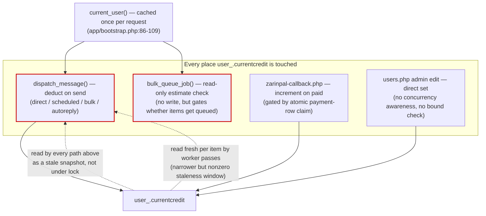

# Credit (cross-cutting: everywhere `user_.currentcredit` is touched)

Unlike the other six docs in this folder, this one is not a single page-to-worker pipeline — it's
the concept that cuts across almost all of them. Credit is stored on
**`user_.currentcredit`, a column ELLSMS does not own** (it belongs to the backend platform's
`user_` table), read and written from several independent code paths with no shared locking
strategy between them. This document exists because that inconsistency is itself the finding.

## Entry points (every place credit is read or written)
1. `dispatch_message()` (`app/backend.php:100`) — the send-time gate and deduction, reached from
   direct send, scheduled send, bulk send, auto-reply, and (bypassed) 2FA. See
   `send-message.md`, `scheduled-message.md`, `bulk-message.md`, `autoreply.md`.
2. `bulk_queue_job()` (`app/backend.php:494`) — an upfront, non-authoritative estimate check at
   queue time, separate from #1's actual enforcement at send time.
3. `zarinpal-callback.php` — increments credit on a confirmed payment. See `payment.md`.
4. `public/users.php` — an admin can set a user's credit directly from the Users edit form
   (README: "per-user sender line, credit (writes to the shared `user_.currentcredit` column)").
   This is a plain admin-entered value with no relation to a send or a payment — it exists for
   manual adjustments/grants.

## Validation
- `dispatch_message()`: `$user['role'] !== 'admin' && (float)$user['credit'] < $cost` — admins
  are never credit-gated (by design: "Admins send without a credit check," per README).
- `bulk_queue_job()`: identical formula, against an independently-fetched snapshot.
- Payment path: `credits` has a minimum (`min_credit_purchase` setting) but **no maximum**.
- Admin edit: no validation observed beyond whatever `users.php` applies to the raw form input
  (no minimum/maximum bound, no reason/audit-note requirement beyond the generic audit log).

## Database reads
- `current_user()` (`app/bootstrap.php:86-109`) reads `user_.currentcredit` once, joined with
  `ellsms_meta`, and **caches the result for the lifetime of the PHP request** (`static $user =
  false`). Every caller within that request that relies on `current_user()`'s cached array is
  working from a single point-in-time snapshot, not a live value — this is fine for rendering a
  page, but it's exactly the value fed into `dispatch_message()`'s and `bulk_queue_job()`'s credit
  checks (see Race-condition risks).
- Worker passes re-fetch credit fresh per row (`run_due_schedules()`, `autoreply_process_one()`,
  `bulk_send_one_item()` each do their own `user_`/`ellsms_meta` join) rather than reusing
  `current_user()` — so the staleness window there is "since this row's own fetch," not "since
  the whole request started," which is narrower but not zero.

## Database writes
| Path | Statement shape | Atomic arithmetic? | Atomic *decision*? |
|---|---|---|---|
| `dispatch_message()` full success | `UPDATE user_ SET currentcredit = currentcredit - ?` | Yes (relative expression) | **No** — gated by a prior stale read |
| `dispatch_message()` partial success | same, smaller `?` | Yes | No |
| `zarinpal-callback.php` | `UPDATE user_ SET currentcredit = currentcredit + ?` | Yes (relative expression) | Yes — gated by the atomic `ellsms_payments` claim (see `payment.md`) |
| `users.php` admin edit | admin-entered value (direct set) | N/A (not a read-modify-write) | N/A — last-write-wins by definition, no concurrent-adjustment awareness |

The important distinction: the SQL *statements* that adjust credit are all individually safe
(MySQL/InnoDB serializes concurrent `UPDATE ... SET x = x ± ?` on the same row — there's no lost
update at the arithmetic level). **The actual defect is upstream of the SQL**, in the PHP-level
decision of *whether to issue the deduction at all*, which uses a value read before the check
rather than a value re-verified atomically with the write.

## External API calls
None directly — credit changes are always a side effect of a send (`dispatch_message()`, which
does call the backend API) or a payment (ZarinPal), never a standalone external call.

## Failure paths
- Insufficient credit at the gate → rejected, nothing charged, clear user-facing message.
- A payment stuck `pending` forever (user never returns from ZarinPal) → credit is never applied,
  and there is no reconciliation job anywhere in this codebase to catch it (see `payment.md`).
- A crash between the payment-row claim and the credit increment → same outcome, permanently.

## Security concerns
- Credit is a direct financial control — any account able to reach `dispatch_message()`,
  `bulk_queue_job()`, or the admin credit-edit form can affect a real balance. The admin edit path
  in particular has the weakest boundary: combined with the `users.php` authorization gap
  documented in `authentication.md`/the STEP 1 audit (4 of 6 id-scoped admin actions don't verify
  the target account was ever granted ELLSMS access), an ELLSMS admin session can currently set
  the credit of **any** account in the shared backend database, not just ones ELLSMS manages.
- The unauthenticated-by-session `url_send.html` endpoint is the easiest place to fire many rapid
  concurrent requests against the same account's credit gate, since there's no browser session to
  naturally serialize a user's own requests against each other.

## Race-condition risks (the systemic picture)
- **The credit check-then-deduct gap in `dispatch_message()` is the root issue.** `$user['credit']`
  is a value already in hand (from `current_user()` or a fresh-but-still-separate `SELECT`)
  before the check runs; nothing re-verifies it under a row lock at the moment of decision. Two
  concurrent qualifying requests for the same account — same-user two browser tabs, two API calls
  via `url_send.html`, or a direct send racing a bulk-queue's worker-side send — can each
  individually see "sufficient credit," both proceed, and both deduct, taking the account's real
  balance below what a single serialized check-then-deduct would have allowed. The account can end
  up with negative credit, which the system otherwise treats as a hard floor.
- **`bulk_queue_job()`'s upfront check widens this rather than closing it** — it duplicates the
  same formula against an even earlier snapshot, and its "yes, this fits" answer is not
  re-validated until each item is actually sent, possibly much later.
- **The fix that closes this without adding row-locking complexity** (see
  `PATHFINDER-2026-07-26/03-unified-proposal.md`, section D, for the future-phase writeup — not
  something to implement as part of this documentation step) is to replace the
  read-then-compare-then-update sequence with one atomic conditional statement, e.g. `UPDATE
  user_ SET currentcredit = currentcredit - ? WHERE id = ? AND currentcredit >= ?`, checked via
  `rowCount()` — turning the gate itself into the same kind of safe, atomic claim the schedule
  and auto-reply worker passes already use for their own concurrency problem.
- The payment-side increment is comparatively safe (gated by an atomic claim on the payment row,
  see `payment.md`) — the credit *ledger* itself has no single consistent invariant enforced
  across all four writers, but the payment path specifically is not the source of the overspend
  risk; the send-time gate is.

