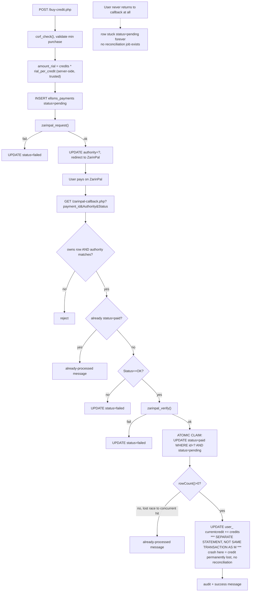

# Payment (ZarinPal credit purchase)

`public/buy-credit.php` (initiate) → ZarinPal-hosted checkout → `public/zarinpal-callback.php`
(verify + credit). Client code in `app/zarinpal.php`. See `docs/flows/credit.md` for how this
fits alongside the other places `user_.currentcredit` is touched.

## Entry point
- `public/buy-credit.php` — authenticated POST, package selection or custom credit amount.
- `public/zarinpal-callback.php` — GET, reached only via ZarinPal's own redirect after checkout;
  carries `payment_id` (ELLSMS's own id, round-tripped through the callback URL), `Authority`
  (ZarinPal's transaction identifier), and `Status` (`OK`/anything else).

## Validation
- `credits = max(0, (int)$_POST['credits'])`, rejected if below `min_credit_purchase` (an admin
  setting). **No upper bound exists** — a user can request an arbitrarily large credit purchase.
- `amount_rial` is computed **server-side** from `credits * rial_per_credit` (an admin-controlled
  setting, not client input) — the client never supplies the charged amount directly, so there is
  no tampering vector into the stored amount.
- Callback: ownership check (`ellsms_payments.user_id` must equal the logged-in user) and an
  authority-echo integrity check (`Authority` query param must match the row's stored
  `authority`) both must pass before any crediting logic is reached.

## Database reads
- `ellsms_settings` — `rial_per_credit`, `min_credit_purchase`, `credit_packages` (display only).
- `ellsms_payments` — by `id` on callback, to recover `user_id`, `credits`, `amount_rial`,
  `authority`, and current `status`.

## Database writes
- `INSERT INTO ellsms_payments (user_id, credits, amount_rial, status='pending')` at purchase
  initiation.
- `UPDATE ellsms_payments SET authority = ?` once ZarinPal's request step returns one.
- `UPDATE ellsms_payments SET status='failed' WHERE id=? AND status='pending'` on any failure
  branch (request failed, verify failed, `Status != OK`).
- **Crediting (the atomic guard):** `UPDATE ellsms_payments SET status='paid', ref_id=? WHERE
  id=? AND status='pending'`, checked via `rowCount()`. This keys on the row's primary key
  `id`, not on `authority` as the README describes — functionally equivalent since `id` is
  already globally unique, but a documentation/implementation mismatch worth knowing about if
  anyone later "fixes" the query to match the README literally (see Race-condition risks).
- `UPDATE user_ SET currentcredit = currentcredit + ?` — **a separate, non-transactional
  statement** from the row-claim UPDATE above (see Race-condition risks — this is the highest-
  severity issue in this flow).
- `ellsms_audit_log` — one row on successful credit.

## External API calls
- ZarinPal v4 REST API (`app/zarinpal.php`): a `request` call (get an `Authority` + redirect URL)
  at purchase time, and a `verify` call at callback time. Both are plain JSON POSTs with a 5s
  connect / 20s total timeout, no retry.

## Failure paths
- ZarinPal request fails (network/API error) → payment row marked `failed` immediately, user
  never leaves ELLSMS, no credit at risk.
- User completes checkout but `Status != OK` (cancelled/failed on ZarinPal's side) → row marked
  `failed`.
- `verify` call itself fails (network/timeout) → row marked `failed` (not left `pending`) —
  handled explicitly, does not need a reconciliation job to resolve *this* case.
- **User pays successfully on ZarinPal but never returns to the callback URL at all** (closes
  browser, connectivity drop before redirect) → the row stays `pending` indefinitely. **No
  cron/worker job polls ZarinPal for stale pending payments** — this is a real, unrecovered gap:
  the customer paid, ZarinPal has the money, and nothing in ELLSMS will ever notice or credit the
  account unless an admin manually investigates.
- A replayed callback for an already-`paid` row is detected (`status` check before the atomic
  claim) and shown as "already processed" rather than re-crediting.
- A replayed callback for an already-`failed` row is a permanent dead end — the atomic claim only
  ever flips rows currently `pending`, so a `failed` row can never be credited via this endpoint
  even if resubmitted with a valid-looking `Authority`.

## Security concerns
- No secret (merchant ID, bot token equivalents) is ever exposed to the client or logged in an
  error message; merchant ID travels only in the JSON POST body to ZarinPal, never in a URL.
- Ownership + authority-echo checks together prevent an attacker from pointing `payment_id` at
  someone else's row, or from replaying a foreign authority against their own row.
- CSRF is correctly checked on `buy-credit.php`'s POST.

## Race-condition risks
- **The double-credit guard itself is solid**: the `UPDATE ... WHERE id=? AND status='pending'`
  claim is a single atomic statement — InnoDB's row lock serializes two concurrent callback hits
  for the same row, and only the first can ever see `rowCount() > 0`. ZarinPal's own `verify`
  endpoint is also idempotency-safe on the ELLSMS side (`zarinpal.php` treats both "success" and
  "already verified" response codes as OK), so even a genuine double-hit on `verify` doesn't
  cause a problem upstream of the claim.
- **The real risk is the gap *between* the two writes, not a race on either one individually.**
  The row-claim UPDATE and the `currentcredit` increment are two separate autocommitted
  statements with no surrounding transaction. If the PHP process dies between them (OOM, worker
  timeout, DB connection drop), the payment is permanently recorded as `paid` — so the guard
  above will never again attempt to credit it — while the customer's credit was never actually
  incremented. This is a lost-update in the "crash between two related writes" sense, not a
  concurrent-request sense, but the practical effect (customer paid, got nothing, no automatic
  recovery) is the same category of problem as the other race-condition findings in this
  document set.
- Missing `UNIQUE` constraint on `ellsms_payments.authority` is confirmed harmless today (nothing
  in the codebase uses `authority` as an `UPDATE`/`SELECT` predicate — the claim keys on `id`),
  but would become load-bearing if a future change moved the claim query to match the README's
  literal description; flagged as a latent trap rather than a live issue.

