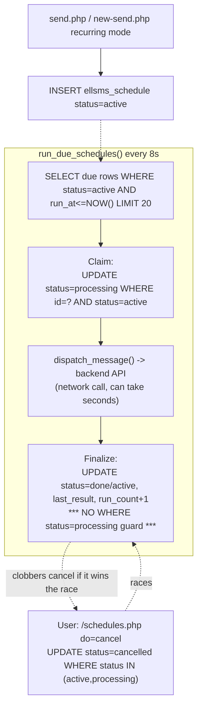

# Scheduled & recurring message

Creation happens in `public/send.php` / `public/new-send.php` ("later"/"recurring" mode);
management (list + cancel) is a separate page, `public/schedules.php`; execution is a worker
pass, `run_due_schedules()` (`app/backend.php:156`).

## Entry point
- `public/send.php:58-60` / `public/new-send.php:77-79` — POST, mode = later/recurring →
  `INSERT INTO ellsms_schedule`.
- `public/schedules.php` — GET (list), POST `do=cancel` (the only mutation this page performs;
  it does not create schedules despite being the natural place to look for that).
- `cron/worker.php` → `run_due_schedules()`, every 8-second tick.

## Validation
- Destinations/content validated the same way as a direct send (see `send-message.md`) at
  creation time; `repeat_type` is one of `none|daily|weekly|monthly` (schema `ENUM`).
- `run_at` is a Jalali date/time picker converted to a Gregorian `DATETIME` via
  `jalali_request_to_gregorian()`; no server-side check observed that `run_at` is actually in
  the future at creation time.
- Cancel: `schedules.php:10` scopes to `user_id = ?` unless admin — ownership is correctly
  enforced for non-admins.

## Database reads
- Worker: `SELECT * FROM ellsms_schedule WHERE status='active' AND run_at <= NOW() ORDER BY
  run_at ASC LIMIT 20` (`app/backend.php:158-160`) — bounded batch per tick.
- Worker: `user_`/`ellsms_meta` join per due row to re-check the owner is `active` and not
  `deleted` before dispatching.
- `schedules.php`: list query scoped by owner (or all, for admin), `ORDER BY status, run_at
  LIMIT 300`.

## Database writes
- Creation: single `INSERT INTO ellsms_schedule`.
- Worker claim: `UPDATE ellsms_schedule SET status='processing' WHERE id=? AND status='active'`
  (`app/backend.php:163-165`) — a proper atomic claim, checked via `rowCount()`, the pattern the
  other two worker passes should also use (see `bulk-message.md`).
- Worker finalize: `UPDATE ellsms_schedule SET status=?, run_at=COALESCE(?,run_at),
  last_run_at=NOW(), last_result=?, run_count=run_count+1 WHERE id=?` (`app/backend.php:190-192`)
  — **unconditional**, no `WHERE status='processing'` guard (see Race-condition risks).
- Cancel: `UPDATE ellsms_schedule SET status='cancelled' WHERE id={$id} AND status IN
  ('active','processing')` — note this is raw string-interpolated SQL (`$id` is int-cast first,
  so not currently exploitable, but inconsistent with the rest of the file's prepared
  statements) and deliberately matches `processing` rows too.
- Credit deduction happens inside `dispatch_message()`, same as every other send path.

## External API calls
- `dispatch_message()` → `POST /api/messages/send`, exactly as for a direct send.

## Failure paths
- Owner account inactive/deleted/access-revoked by the time the schedule comes due → dispatch is
  skipped, `last_result` records the reason, `status` still transitions to `done`/`active` as
  appropriate (a "failure" here is a recorded outcome, not a stuck row).
- Repeating schedules compute the next `run_at` by advancing the interval past `time()` in a
  loop (`app/backend.php:184-187`), so a schedule that was somehow missed for multiple cycles
  catches up to "next occurrence after now" rather than firing once per missed cycle.

## Security concerns
- No security-specific issues beyond what's already covered generically by `send-message.md`
  (this flow's only unique surface is the create/cancel forms, both of which are correctly
  CSRF-checked and ownership-scoped for non-admins).

## Race-condition risks
- **Cancel vs. worker finalize is a genuine lost-update race — the most concrete bug in this
  flow.** Sequence: worker claims a due row (`status → 'processing'`) and begins
  `dispatch_message()`, which involves a real network call to the backend API and can take
  seconds. While that's in flight, the owning user loads `/schedules.php` (which shows a cancel
  button for both `active` and `processing` rows) and clicks cancel — the cancel `UPDATE`
  succeeds (it explicitly matches `processing`) and the row becomes `cancelled`. Moments later,
  the worker's own finalize write has no status guard and unconditionally overwrites the row
  back to `done` (or `active`, if repeating) — silently clobbering the user-visible cancellation.
  The message was still actually sent and credit was still actually charged; only the *displayed
  status* briefly said "cancelled" before being reverted. For a repeating schedule, this also
  means a "cancelled" recurring send can resume firing on its next cycle.
- No race risk identified in the claim step itself (`UPDATE ... WHERE status='active'` is a
  correct atomic claim under InnoDB row locking) — the bug is specifically in the *finalize*
  step and the cancel handler's willingness to match `processing` rows without the worker also
  respecting that.

