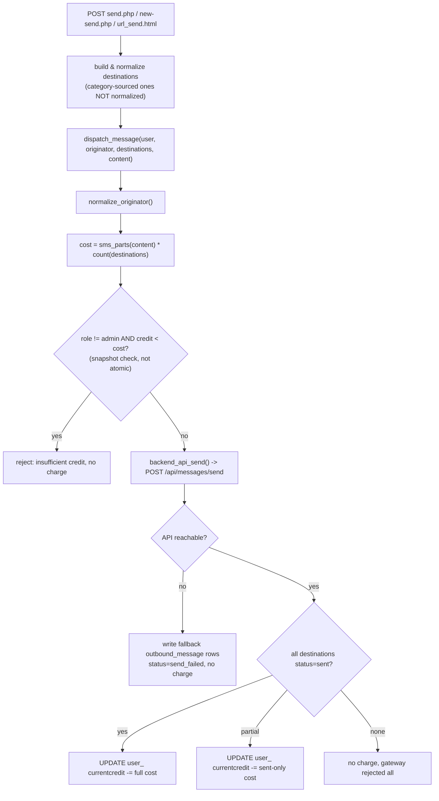

# Send message (direct send)

Covers the single choke point every immediate send goes through: `dispatch_message()`
(`app/backend.php:100`). Reached from `public/send.php`, `public/new-send.php` (direct mode),
and `public/sms/url_send.html` (legacy unauthenticated-by-session API). Scheduled sends, bulk
sends, and auto-replies also call this function — see their own flow docs for what happens
*before* they get here.

## Entry point
- `public/send.php` / `public/new-send.php` — authenticated (session), CSRF-protected POST.
- `public/sms/url_send.html` — unauthenticated by session; the request itself carries
  `username`/`password` (via `$_REQUEST`, i.e. usable over GET or POST) checked against `user_`
  directly, independent of any browser cookie.

## Validation
- `parse_destinations()` / manual entry normalized via `normalize_msisdn()` — group members and
  manually-typed destinations are normalized; **destinations sourced from a "number category"
  are pushed in raw, without `normalize_msisdn()`**, in both `send.php:38-42` and
  `new-send.php:40-44` (identical gap in both files).
- `dispatch_message()` itself validates: destinations non-empty, content non-empty,
  `normalize_originator()` succeeds (originator must reduce to a non-empty digit string).
- Credit check: `$user['role'] !== 'admin' && (float)$user['credit'] < $cost` — see
  Race-condition risks; `$user['credit']` is a value captured earlier in the request, not
  re-read atomically at this point.
- `url_send.html` additionally requires the authenticating account to have
  `ellsms_meta.panel_access = 1` (checked after password verification, distinct error code).

## Database reads
- `ellsms_numbers` (assigned sender lines), `ellsms_number_categories`/`_items`, group data from
  `ellsms_contacts` — to build the destination list and originator dropdown.
- `user_` / `ellsms_meta` — current user's credit and role (via `current_user()`, cached once
  per request) or, for `url_send.html`, a fresh lookup by username.
- `ellsms_blacklist` — only on `new-send.php` when the "send to whitelist only" toggle is on
  (`filter_blacklist()`).

## Database writes
- **Happy path (API reachable, all destinations sent):** `UPDATE user_ SET currentcredit =
  currentcredit - ?` (`app/backend.php:138-144`) — this is the *only* write ELLSMS performs;
  the actual `outbound_message` rows are written by the backend API itself, not by ELLSMS.
- **Fallback path (API unreachable):** ELLSMS writes its own `outbound_message` rows directly
  with `status='send_failed'` (`app/backend.php:120-127`) — the one documented, deliberate
  exception to "ELLSMS never writes backend-owned tables," specifically so a failed attempt is
  still visible in reports even though the backend API never got to record it itself.
- `ellsms_audit_log` — for `url_send.html`, logs the real `outbound_message.id` alongside the
  random `reference_id` handed back to the caller, so support can trace one from the other.

## External API calls
- `POST {API_BASE_URL}/api/messages/send` (`backend_api_send()`, `app/backend.php:34`) —
  5s connect timeout, 30s total timeout, no retry. Response is a JSON array, one object per
  destination, each with its own `status`/`error_code` — a batch can partially succeed.

## Failure paths
- API unreachable/network error → `[false, ...]`, fallback `outbound_message` rows written,
  user sees the real connection-error reason (via `describe_api_error()`), no credit charged.
- API reachable but rejects some/all destinations → no fallback rows (the API's own response is
  authoritative), user is charged only for parts that actually sent (partial-success branch,
  `app/backend.php:140-144`).
- Insufficient credit → rejected before any API call, no charge, no rows.
- `url_send.html` maps every failure into one of six stable `error_code` values (`-1`..`-6`);
  `-5` (insufficient credit) is detected by `str_contains()` matching a specific Persian string
  that originates from `dispatch_message()`'s human-readable message — any future rewording of
  that message silently reclassifies the failure as `-6` instead.

## Security concerns
- **`url_send.html` accepts credentials via GET**, as advertised in its own docblock — this puts
  the account password in web server access logs, proxy logs, and browser history for any caller
  using that form. Must be run behind HTTPS (documented in `README.md`); the risk is in *how* the
  endpoint is used, not solely in the transport.
- **Error-code oracle for brute force**: `-2` (bad credentials) is distinguishable from `-3`/`-4`/
  `-5`/`-6` (all of which require the password check to have already passed), so an attacker can
  detect a successful guess independent of whether the account can actually send anything.
- **No rate-limiting or lockout** on `url_send.html` — the only defense is a flat, per-request
  `usleep(400000)` on failure, which slows a single serial attacker but not a parallelized one.
- Category-sourced destinations bypassing `normalize_msisdn()` (see Validation) means a
  malformed number from a category can reach the backend API in a different shape than every
  other destination in the same batch, with no application-level validation of its format.

## Race-condition risks
- **Credit check-then-deduct is not atomic** (`app/backend.php:110-112` check,
  `:138-144` deduct). `$user['credit']` is a snapshot, not re-read under lock at deduction time.
  Two concurrent requests from the same account — most easily via `url_send.html`, which has no
  session to serialize a user's own requests against each other — can both pass the check before
  either deducts, permitting overspend below zero. See `docs/flows/credit.md` for the full
  cross-cutting picture of every place credit is touched.

