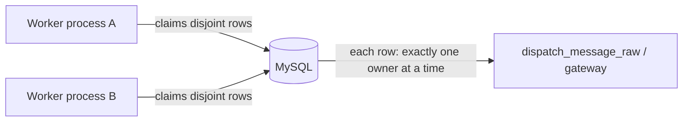
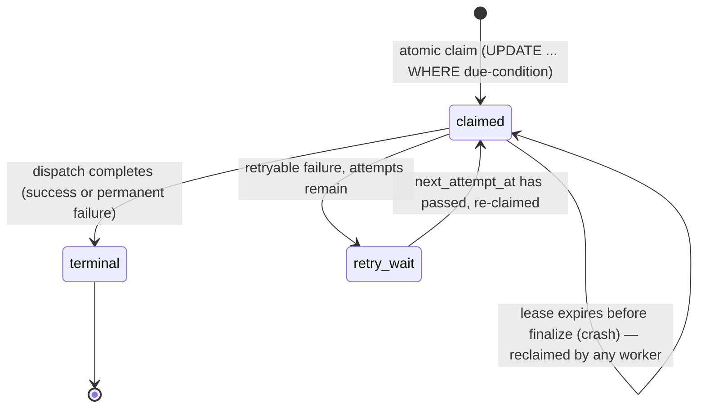
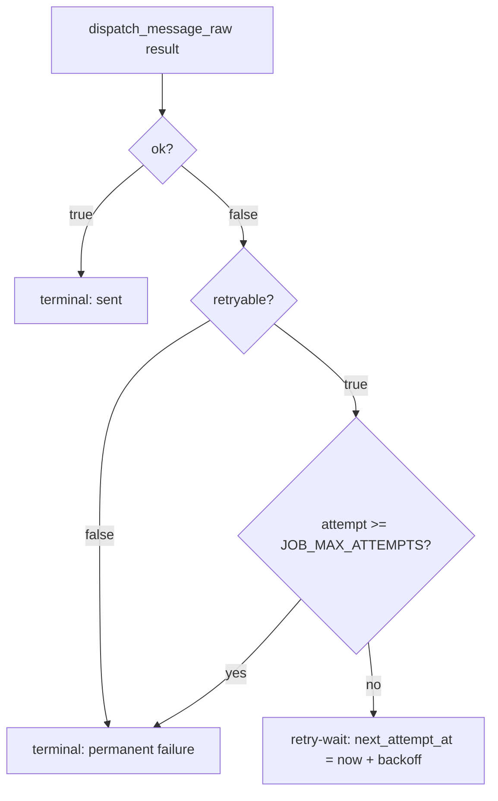
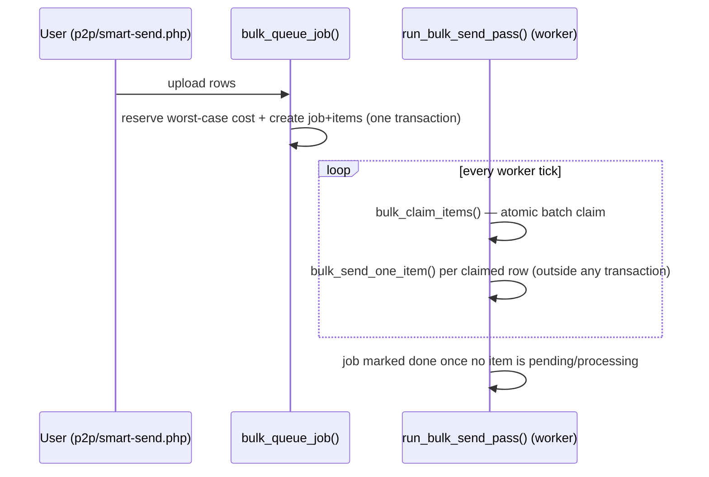
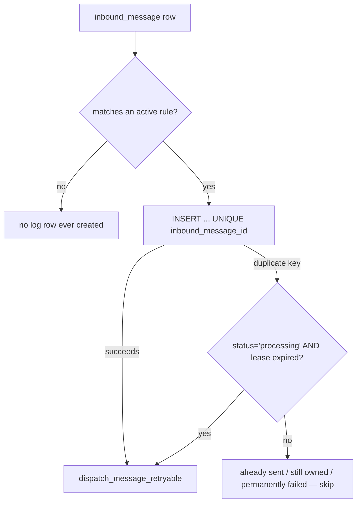

# ELLSMS — Job Queue Architecture (Phase 4)

This document describes the worker/job-claiming reliability model introduced in Phase 4 to make
background execution safe under multiple concurrent worker processes, crashes, and transient
failures — closing `docs/technical-debt.md` TD-007 (no atomic per-item claim), TD-008 (schedule
cancellation race), and TD-009 (no mutex between worker invocation modes; addressed here by making
concurrent execution itself safe, rather than by adding a lock). It builds directly on Phase 3's
wallet ledger (`docs/wallet-architecture.md`) — every financial operation below reuses that
ledger's idempotency, reservation, and commit/release primitives rather than reimplementing them.

## Scope

Three background execution paths, all in `app/backend.php`, all driven by `cron/worker.php`:

| Path | Claim mechanism | Table(s) |
|---|---|---|
| Bulk send (p2p/smart/gradual) | `bulk_claim_items()` — atomic multi-row `UPDATE ... ORDER BY id LIMIT n` | `ellsms_bulk_jobs`, `ellsms_bulk_items` |
| Scheduled/recurring send | Atomic single-row `UPDATE ... WHERE id=? AND (due-condition)` | `ellsms_schedule` |
| Auto-reply (منشی پیامک) | `INSERT` under a `UNIQUE(inbound_message_id)` constraint, falling back to a conditional `UPDATE` reclaim | `ellsms_autoreply_log` |

## Worker model

`cron/worker.php` runs either as a persistent loop (poll every `WORKER_POLL_INTERVAL_SECONDS`,
default 8s) or once via `--once` (cron-invoked). Multiple instances — multiple containers, or a
persistent loop plus a cron `--once` overlapping — are safe to run simultaneously; that safety is
the entire subject of this document, not an assumption. Each process computes a `worker_id()`
identity once (`hostname:pid:random`, cached for the process's lifetime) used as `claimed_by` in
every claim and included in every structured log line for that process's work.

## Claim lifecycle

Every claim is a single atomic SQL statement whose `WHERE` clause re-states the exact eligibility
condition just checked — a genuine compare-and-swap, not a separate check-then-act:

- **Bulk items** (`bulk_claim_items()`): a plain `UPDATE ... ORDER BY id LIMIT n` claims up to `n`
  rows in one statement. **Not** `SELECT ... FOR UPDATE SKIP LOCKED`, which was the first
  implementation tried — `tests/Integration/BulkItemConcurrencyTest.php` caught it silently
  returning fewer rows than were actually free under genuine two-process concurrent load (confirmed
  via `EXPLAIN`: MySQL's optimizer picked a full index-order scan instead of an index range seek for
  the compound `(pending AND due) OR (processing AND lease-expired)` condition, and that scan shape
  combined with `SKIP LOCKED` under concurrency under-returned — reproduced consistently across
  multiple real subprocess runs, independent of `READ COMMITTED` vs the default `REPEATABLE READ`).
  Issued as two simple, separately-indexed passes (fresh-due pending, then expired-lease reclaim)
  instead of one compound-condition query, each using a clean `ref`-type lookup on the existing
  `(job_id, status)` index. A random per-call `claimToken` (embedded in `claimed_by`) lets the
  follow-up `SELECT` identify exactly which rows this call claimed, since `UPDATE` has no
  `RETURNING`.
- **Schedules** (`run_due_schedules()`): `UPDATE ellsms_schedule SET status='processing', ... WHERE
  id=? AND (due-condition)` — single row by primary key, no `LIMIT`/`SKIP LOCKED` complexity, so this
  pattern was never subject to the bug above.
- **Auto-reply** (`autoreply_process_one()`): `INSERT ... ON` a `UNIQUE(inbound_message_id)`
  constraint is the primary claim (unchanged from before Phase 4 — it already correctly prevented
  two workers from both replying to the same inbound row). On a duplicate-key conflict, a
  **conditional `UPDATE`** (not a second `INSERT`, and deliberately not preceded by its own `SELECT
  ... FOR UPDATE`) attempts a reclaim — see "A note on lock-then-insert deadlocks" below.

## Lease model

Every claim stamps `claimed_by`, `claimed_at` (bulk items/schedules), and `lease_expires_at =
NOW() + WORKER_JOB_LEASE_SECONDS` (default 300s). While the lease is valid, no other worker's claim
query matches that row. Once it expires, the exact same claim query that made the original claim
also reclaims it — there is no separate "is this expired" check anywhere; expiry is just another
input to the same atomic compare-and-swap. This means crash recovery is not a distinct code path: a
crashed worker's abandoned claim becomes reclaimable the next time *any* worker (including itself,
if it restarts) runs its normal claim query, once the lease has passed.

**Retry-wait is not a status.** A row awaiting its backoff window stays in its normal
non-terminal state (`pending` for bulk items, `active` for schedules, `processing` for auto-reply)
with `next_attempt_at` (bulk items/schedules) or a forward-dated `lease_expires_at` (auto-reply,
which reuses the same column for both "still owned" and "not yet eligible for retry" — see its own
section below) gating re-claimability. This was a deliberate choice: it means every pre-existing
"is this job done" query (`NOT EXISTS ... WHERE status IN ('pending','processing')`) already treats
a retry-wait row as "not done" correctly, without needing a new status value or a corresponding
query update everywhere that status is read (STEP 22).

## Retry policy

`app/jobqueue.php`:

- `job_max_attempts()` — `JOB_MAX_ATTEMPTS`, default 5.
- `job_retry_backoff_seconds($attemptCount)` — bounded exponential: `base * 2^(attempt-1)`, capped
  at `JOB_RETRY_MAX_SECONDS`. Defaults (`JOB_RETRY_BASE_SECONDS=30`, `JOB_RETRY_MAX_SECONDS=1800`):
  30s, 1m, 2m, 4m, 8m for attempts 1–5.

Classification happens in `dispatch_message_raw()`, structurally, not by string-matching an error
message: **retryable** only when ELLSMS itself failed to reach the gateway (network/timeout/no
usable HTTP response — `backend_api_send()`'s "unreachable" branch). **Permanent**: empty
destination/content, invalid or unauthorized originator, insufficient credit, or the gateway being
reached and explicitly rejecting every destination (treated as permanent — a real response, most
often an invalid destination, and retrying identical input against the same gateway is expected to
fail identically). This mapping is deliberately narrow — see `dispatch_message_raw()`'s own
docblock for the exact branch-by-branch reasoning.

## Failure / dead-letter state

No separate dead-letter table or infrastructure — a database-backed terminal state is sufficient
(STEP 18), matching this project's existing convention (no Redis/RabbitMQ anywhere). Terminal
failure states: `failed` (bulk items), `done` (schedules — a one-time schedule; a recurring one
still advances to its next occurrence regardless, matching pre-Phase-4 behavior, see below),
`failed_permanent` (auto-reply log). Each retains `error`/`last_result`/`info` (the last failure
reason) and `attempt_count` for operator visibility (`make jobs-status`); response bodies are never
stored verbatim to avoid leaking anything sensitive a future gateway response might contain.

## Cancellation semantics

**Bulk jobs**: cancelling (`public/p2p-send.php`, `public/smart-send.php`) flips the job to
`status='cancelled'` and marks every still-`pending` item `cancelled` (STEP 21) — items already
`processing` are left alone; their own fate is decided by the fresh re-check below. Because every
claim query only selects from jobs whose status is already `'processing'`, a cancelled job simply
stops being a source of new claims from that point on. The one race this doesn't structurally
close — an item claimed in the same instant a cancellation lands — is closed explicitly:
`bulk_send_one_item()` re-reads the job's status **fresh from the database** immediately before
dispatch (not from the claim-time snapshot, which was tried first and found to be stale exactly in
this scenario — the array `bulk_claim_items()` returns intentionally does not include job status at
all anymore, to make that mistake structurally impossible to repeat). If cancelled, the item is
marked `cancelled` and never reaches the gateway.

**Schedules**: `public/schedules.php`'s cancel action can target a row that's already `processing` —
a worker claimed it moments before the user cancelled. `run_due_schedules()` re-checks status
immediately after claiming, before any dispatch. If cancelled by then, nothing is dispatched and
nothing was ever reserved. If cancellation lands *after* dispatch (a narrower window — between the
re-check and the finalize `UPDATE`), the finalize statement itself is guarded: `status = CASE WHEN
status='cancelled' THEN 'cancelled' ELSE ? END` — a send that already happened is recorded
truthfully (`last_result`, `run_count` both still update) without silently reverting the user's
cancellation back to `active`/`done`. This is the exact TD-008 fix — the pre-Phase-4 finalize
`UPDATE` had no such guard at all.

Both cancellation paths are idempotent by construction: re-cancelling an already-cancelled job/item
matches nothing (`WHERE status IN (...)` no longer includes `cancelled`) and is a silent no-op.

## Bulk processing model

Unchanged from Phase 3: the job's full worst-case cost is reserved once, atomically, at creation
time (`bulk_queue_job()`); each item commits its own actual cost against that single reservation,
keyed by item id, when it reaches a terminal outcome (not on every attempt — see "Wallet
integration" below); the job's leftover reservation is released once nothing pending/processing
remains for it.

## Schedule occurrence model

A recurring schedule reuses one row for every occurrence. Occurrence identity for financial/claim
purposes is `{schedule_id}:{run_count}` (Phase 3, STEP 10) — `run_count` only increments on a
terminal outcome, so a retry-wait cycle never collides with the next real occurrence's reference.
Recurring-occurrence safety (advancing `run_at` exactly once) was already correct before Phase 4:
only one worker can hold the `processing` claim at a time, and the next `run_at` is computed and
persisted in the *same* `UPDATE` as the status transition — never a separate step two workers could
race on independently. Phase 4 added the lease (crash recovery), the cancellation-race guard above,
and retry/backoff on top of that already-correct core.

## Auto-reply idempotency

`run_autoreply_pass()` has two scan halves: the normal cursor-based scan (`inbound_message.id >
last_seen`, cursor advances once per whole pass — unchanged from before Phase 4) for genuinely new
inbound rows, plus a **retry-due scan** (`ellsms_autoreply_log WHERE status='processing' AND
lease_expires_at < NOW()`) added in Phase 4. This second scan is necessary, not optional: once the
cursor advances past a row's id, the normal scan never revisits it — a retry-scheduled row would
otherwise never actually be retried in the non-crash case, only recovered after a crash (found
during Phase 4's own test-writing, `tests/Integration/AutoreplyQueueTest.php`).

**A note on lock-then-insert deadlocks.** The reclaim path is a single conditional `UPDATE`,
deliberately *not* preceded by its own `SELECT ... FOR UPDATE` to check reclaimability first. Two
concurrent workers processing the *same brand-new* inbound row would otherwise both take a lock via
the failed `INSERT`'s own duplicate-key check, then both try to acquire the `SELECT ... FOR UPDATE`
lock — the exact deadlock shape Phase 3 hit and fixed in `app/wallet.php`'s `wallet_lock_account()`
(see `docs/phase-3-final-report.md`). The single-`UPDATE` reclaim has no such two-statement
lock-then-lock window.

## Wallet integration

Reuses Phase 3's ledger exactly — no new financial primitives, only a new *caller pattern*:

- **Bulk items** already matched this correctly before Phase 4: the job's cost is reserved once at
  creation; each item commits its own actual cost via `wallet_commit_reservation()`, keyed by item
  id, only when it reaches a terminal outcome.
- **Schedules and auto-reply** did **not** match it, and Phase 4 found a real bug fixing that:
  `dispatch_message()` (the pre-Phase-4 call both paths used) reserves, dispatches, and
  **finalizes** (commits the actual cost, releases the remainder) in one call, every call. That's
  correct for a true one-shot send, but wrong for a genuine retry: a second call with the same
  `refType`/`refId` finds the reservation already finalized by the first attempt and short-circuits
  as `"این ارسال قبلاً پردازش شده است"` (already processed) — reporting success **without ever
  calling the gateway again**. `tests/Integration/AutoreplyQueueTest.php`'s second-attempt
  assertions caught this directly (a real bug, not a hypothetical). Fixed with a new
  `dispatch_message_retryable()` (`app/backend.php`) that only commits/releases once the occurrence
  reaches a genuinely terminal outcome — success, a permanent failure, or attempts exhausted — the
  same threshold the retry-scheduling decision itself uses, so the two can't drift apart. A
  retryable failure with attempts remaining leaves the reservation **active** (the worst-case cost
  stays held, not returned to available balance) so the next attempt can genuinely dispatch again
  instead of instantly replaying a stale "already handled" result. `dispatch_message()` itself is
  unchanged and remains correct for its own callers (direct/API sends, 2FA — genuinely one-shot,
  never retried).

## Authorization revalidation

Every claimed row's owner is re-checked (`is_backend_account_active()` / `has_panel_access()`)
immediately before dispatch — unchanged from Phase 2, still true here: a revoked user's
already-queued schedule/bulk item/auto-reply rule stops firing the moment it's next claimed, not
just at creation time. An authorization failure is always classified permanent (never retried) —
see `bulk_send_one_item()`, `run_due_schedules()`, `autoreply_process_one()`.

## Exactly-once limitations (honest boundary, per Phase 3's own precedent)

Claim exclusivity (Invariant B, proven under real concurrency by
`tests/Integration/BulkItemConcurrencyTest.php`) guarantees **at most one worker dispatches a given
item at a time**. It does **not** guarantee the underlying SMS is delivered exactly once end-to-end:
if a worker crashes *after* the gateway has accepted/sent a message but *before* this process's own
finalize `UPDATE` commits, the lease will eventually expire and another worker will reclaim and
retry — the financial side stays exactly-once (the wallet's per-item/per-occurrence idempotency key
makes a replayed commit a safe no-op), but the backend gateway itself has no idempotency key of its
own in this integration, so a duplicate *SMS* could in principle be sent in that exact narrow
window. This is the same honest boundary Phase 3 already documented for direct sends
(`docs/wallet-architecture.md`) — Phase 4 does not claim to close it, because the gateway's own API
doesn't support the idempotency key that would be required to.

## Database migrations

`db/migrations/2026_07_28_job_queue_reliability.sql` — adds `claimed_by`/`claimed_at`/
`lease_expires_at`/`attempt_count`/`next_attempt_at` to `ellsms_bulk_items` and `ellsms_schedule`
(plus widening `ellsms_bulk_items.status` to add `processing`/`cancelled`); adds
`status`/`claimed_by`/`lease_expires_at`/`attempt_count` to `ellsms_autoreply_log`. Idempotent
(`information_schema` guards), scoped strictly to ELLSMS-owned tables, never auto-applied — see
`db/migrations/README.md`.

## Operational commands

- `make jobs-status` — read-only status/lease/retry counts across bulk items, bulk jobs, schedules,
  auto-reply log. Cheap indexed aggregates, safe on demand (deliberately not folded into `/health`
  — STEP 33 explicitly warns against an expensive queue scan there).
- `make jobs-recover` — read-only list of rows whose lease has expired. Every one of these is
  already self-healing (the next normal worker tick reclaims it automatically); this is for
  visibility, not a required step.
- `make jobs-recover-force` — also clears those expired leases immediately, so the very next tick
  reclaims them rather than waiting on worker timing. Never touches a row whose lease is still
  valid.

## New environment variables

| Variable | Default | Used by |
|---|---|---|
| `WORKER_JOB_LEASE_SECONDS` | 300 | `worker` |
| `JOB_MAX_ATTEMPTS` | 5 | `worker` |
| `JOB_RETRY_BASE_SECONDS` | 30 | `worker` |
| `JOB_RETRY_MAX_SECONDS` | 1800 | `worker` |
| `WORKER_BULK_BATCH_SIZE` | 20 | `worker` (Phase 9 — see below) |

## Phase 9 addendum — measured behavior, one query fix, queue-technology decision

Full methodology and numbers: `docs/observability-and-performance.md` and
`docs/phase-9-final-report.md`. Summary of what changed in the model this document describes:

- **`run_due_schedules()`'s due-row lookup was rewritten** from `COALESCE(next_attempt_at, run_at)
  <= NOW()` to a logically-identical, sargable explicit-branch form
  (`schedule_due_condition_sql()`). The old form could never use `idx_due (status, next_attempt_at,
  run_at)` — confirmed via EXPLAIN against 20,000 seeded rows: full table scan, 20000 rows
  examined, versus a range scan on `idx_due`, 2002 rows examined, after the fix. Behavior is
  unchanged (regression-pinned: `tests/Integration/QueryPlanRegressionTest.php` proves exact
  row-selection equivalence to the old form).
- **`WORKER_BULK_BATCH_SIZE`** replaces a bare literal `20` at `run_bulk_send_pass()`'s unthrottled
  claim call — default unchanged, now tunable. Phase 9's own batch-size benchmark found 10/20/50
  perform similarly and 100 measurably worse at low worker counts — no reason found to change the
  default.
- **Multi-worker scaling measured strong (94.6% efficiency) from 1→2 workers**, with zero measured
  database lock contention at any tested concurrency up to 8 workers — the atomic
  `UPDATE ... ORDER BY id LIMIT n` claim design this document describes holds up under real
  concurrent load, not just the isolated concurrency tests that originally validated it.
- **A live crash test** (a real worker process `kill -9`'d mid-dispatch, not a simulated one)
  confirmed the crash-recovery model this document describes end-to-end: the row became
  reclaimable once its lease expired, a fresh pass reclaimed it (`attempt_count` incremented,
  proving genuine reclaim), and exactly one wallet commit occurred despite the crash.
- **Queue technology decision: KEEP MYSQL.** Full reasoning in
  `docs/phase-9-final-report.md` §24-25 — no measured bottleneck this document's design has, that a
  different queue technology would fix.

## Message classes and priority isolation (issue #3)

Six agreed message classes, highest priority first: **OTP > Transactional > Notification >
Scheduled > Bulk Campaign > Advertising** — declared once in `app/MessageClass.php`
(`message_classes_by_priority()`), so every place that orders or labels by class reads from the
same list instead of re-declaring it.

**Isolation today is mostly structural, not a shared queue with priority flags:**

| Class | How it's isolated | Table |
|---|---|---|
| OTP, Transactional, Notification | Never queued — sent synchronously inside the web request via `dispatch_message()`. Cannot be blocked by worker/queue backlog because they never touch the worker. | none (direct `outbound_message` write via the backend API) |
| Scheduled | Its own table, its own claim query, its own worker pass (`run_due_schedules()`), which runs *before* the bulk pass every tick. | `ellsms_schedule` |
| Bulk Campaign, Advertising | Share `ellsms_bulk_jobs`/`ellsms_bulk_items` (tagged by the new `message_class` column) — the only two classes that actually contend for one claim budget. | `ellsms_bulk_jobs`, `ellsms_bulk_items` |

**Where real contention exists (Bulk Campaign vs. Advertising), priority is enforced by a per-tick
quota, deliberately NOT by ordering a mixed-class claim:**

`bulk_claim_unthrottled_items_by_class()` (`app/backend.php`) measures the current pending depth of
each class, then calls `allocate_priority_quota()` (`app/QueueFairness.php`) to split
`WORKER_BULK_BATCH_SIZE` between them: each non-empty class is first guaranteed a floor share
(`queue_class_min_share()` — Advertising's floor is deliberately the smallest nonzero share), and
only the leftover budget is handed out strictly by priority. It then calls `bulk_claim_items()`
**once per class**, each call already filtered to that one class via `$jobFilterSql` — so no single
claim ever spans multiple classes, and `bulk_claim_items()` itself needs no class-aware ordering at
all. This is what prevents a huge Advertising backlog from starving a newer, smaller Bulk Campaign
job to zero throughput indefinitely — see
`tests/Unit/QueueFairnessTest.php::testAdvertisingIsNeverStarvedToZeroUnderSustainedBulkCampaignOverload`.

An earlier version of this instead joined `ellsms_bulk_jobs` directly onto `bulk_claim_items()`'s
claim `UPDATE` so one call could `ORDER BY` priority across classes. A real load test (issue #4,
`cron/load-test.php`, 4 concurrent worker processes) caught it leaving ~3% of claimed items stuck in
`processing` forever — the join pulls `ellsms_bulk_jobs` into the claim's lock scope, creating lock
contention with whatever else concurrently touches that table, which the original single-table
`UPDATE ... ORDER BY id LIMIT n` never had. Reverted; see `bulk_claim_items()`'s own docblock in
`app/backend.php` for the full account. The lesson generalizes: this function's claim query must
stay single-table, full stop — any future need to order by something other than `id` should be
solved by more/smarter calls to it (as above), never by joining another table onto it.

**Tuning without a code rewrite:** `WORKER_BULK_BATCH_SIZE` (`.env`) still controls the total
per-tick budget shared across classes; `queue_class_min_share()`'s floors are a code-level policy
today (a config surface for them is a natural follow-up, not yet built — see Known limitations
below).

**Metrics** (via `Metrics::gauge`, tagged `message_class`): `queue.bulk.depth` (pending rows) and
`queue.bulk.oldest_age_seconds` (age of the oldest claimable row), emitted once per worker tick from
`bulk_claim_unthrottled_items_by_class()`. Per-claim throughput/lag were already emitted by
`bulk_claim_items()` as `queue.claim.bulk_items` timing/gauges; calling it once per class (instead
of once for the whole budget) means those are now implicitly per-class too, distinguishable by the
`job_type`/timing context each call site logs.

**Assigning a class:** `bulk_queue_job()` takes an optional trailing `$messageClass` argument
(`normalize_bulk_message_class()` restricts it to `'bulk_campaign'`/`'advertising'`, defaulting to
`'bulk_campaign'` for anything else). No current UI page passes anything but the default — every
existing نظیر به نظیر / پیامک هوشمند / ارسال تدریجی job is `bulk_campaign`, matching prior
behavior exactly. Wiring an actual "این یک ارسال تبلیغاتی است" toggle into `new-send.php` (or a
dedicated advertising/broadcast page) is a follow-up, not part of this change.

**Known limitations / follow-ups:**
- The legacy, non-"fast" `run_bulk_send_pass()` (used only by `cron/load-test-worker-runner.php`,
  not by the production worker loop) was not updated to use per-class quotas — the production path
  (`run_bulk_send_pass_fast()`, what `cron/worker.php` actually calls) is the one this section
  describes.
- `queue_class_min_share()`'s floors are fixed in code rather than `.env`-configurable per class;
  `WORKER_BULK_BATCH_SIZE` remains the one live-tunable knob for this budget.
- No UI yet lets an operator create an explicit Advertising-class job — the plumbing (column,
  per-class quota) is in place for whichever future page needs it.
