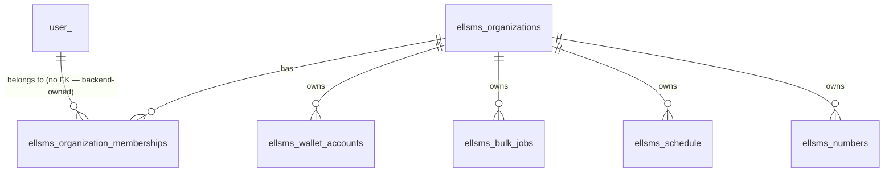
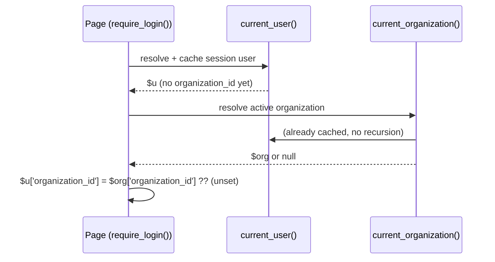
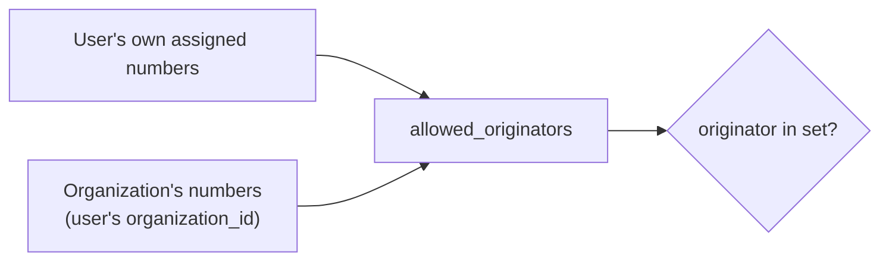

# ELLSMS — Multi-Tenancy Architecture (Phase 6)

This document describes the Organization/Membership foundation introduced in Phase 6
(`docs/phase-6-final-report.md`) on top of Phase 5's database-integrity work
(`docs/database-migrations.md`). It moves ELLSMS from purely user-owned application data toward
organization-owned data with user memberships, without breaking any existing installation.

## Organization model

`ellsms_organizations`: `id`, `name`, `slug` (unique), `status` (`active`/`suspended`/`disabled`),
`created_by_user_id`. `ellsms_organization_memberships`: `organization_id` + `user_id` (unique
pair), coarse `role` (`owner`/`admin`/`member` — **delivered as Phase 7's fine-grained permission
matrix on top of these same three role values, no schema change; see `docs/rbac-architecture.md`**),
`status` (`active`/`revoked`). Both tables are pure ELLSMS-owned
additions; neither has a hard FK to `user_` (same policy as every `ellsms_*` table since Phase 1 —
see `docs/database-audit.md`).

## Membership model & roles

Three coarse roles, no permission matrix: `owner` (created the organization; protected from
last-owner removal), `admin`/`owner` may manage membership (`is_organization_manager()`), `member`
has ordinary access to organization-owned resources. This is **not** the same thing as the
pre-existing platform-level `ellsms_meta.is_admin` flag (Phase 2) — see "Admin model" below.

## Tenant context resolution

`app/tenant.php` — mirrors `app/bootstrap.php`'s `current_user()`/`require_login()` pattern:

- `current_organization()`: session-selected (`$_SESSION['organization_id']`), re-validated against
  real membership on **every** call (never cached across a membership change in a way that could go
  stale — see the function's own cache-key design, keyed on `userId:selectedId` together). Falls
  back to auto-selecting the sole active membership only when there is exactly one candidate (the
  universal shape for a legacy-migrated single-person organization). Returns `null` — never a
  guess — for zero or multiple unselected candidates.
- `require_organization()` / `require_active_organization()`: fail closed (403) rather than
  guessing; the `_active` variant additionally rejects a `suspended` organization, for send/mutation
  pages specifically (STEP 3 — historical/read-only pages should use the plain
  `require_organization()` so a suspended org's owner can still review their own data).
- `select_organization(int $organizationId)`: the **only** place `$_SESSION['organization_id']`
  should be written from user-facing code — re-validates membership before switching, so a crafted/
  guessed id is a silent no-op, never a leak (Invariant D).
- `can_access_organization()`, `organization_membership()`, `user_organization_memberships()`: pure,
  session-independent lookups by explicit `$userId` — used by both the session-bound functions above
  and directly by background/worker code that has no session at all.

`require_login()` (`app/bootstrap.php`) now attaches `organization_id` to the array it returns,
automatically, for every page that already calls it — resolved via `current_organization()` *after*
`current_user()` has finished resolving (calling it from inside `current_user()` itself would
recurse, since `current_organization()` calls `current_user()` internally to find the acting user).

## Legacy migration strategy

**One organization per existing user** — the safest choice per this phase's own instructions: it
preserves exact current isolation (nobody gains access to anyone else's data as a side effect)
rather than guessing at any grouping. `cron/tenant-backfill.php` (`make tenant-backfill`
/`-dry-run`):

1. Every row in `ellsms_meta` without an existing membership gets a new `"{name}'s Workspace"`
   organization, created via `create_organization()` (atomic: organization + owner membership +
   wallet-account organization_id, all-or-nothing).
2. Every tenant-owned table's `organization_id` is backfilled from the owning `user_id`'s now-
   guaranteed organization.
3. A row whose `user_id` has **no** resolvable `ellsms_meta` row (never a real panel user — pre-
   existing orphaned data, not created by this migration) is **quarantined**, not guessed:
   `organization_id` stays `NULL`, reported by count, never silently assigned.

`ellsms_number_categories` is deliberately **not** backfilled — see "Number categories" below.

## Wallet ownership

**Wallet mechanics are unchanged** — `app/wallet.php`'s functions remain keyed by `user_id` exactly
as Phase 3 built and proved them (reserve/commit/release, idempotency keys, row-locking). This phase
does **not** rewrite financial correctness, per its own explicit instruction. What's added:
`organization_id` on `ellsms_wallet_accounts`/`_transactions`/`_reservations` as a **descriptive
ownership label**, backfilled from the owning user's organization and set at write time by
`create_organization()` for new organizations — kept consistent by construction (every wallet
mutation is still driven by a single `user_id`, and that user's own organization never changes
without an explicit membership action this phase's tooling controls).

For the migrated legacy shape (one organization per user), this is *exactly* equivalent to today's
behavior — the wallet "belongs to" a user and that user's own organization simultaneously, because
they're the same fact expressed two ways. The organization_id column exists so a **future** phase
building genuine multi-user shared billing on top of this foundation has a consistent label to key
off, without this phase needing to solve "what does it mean for two people to jointly own one
wallet's row-locking" — a real design question deliberately left for whenever that's actually
needed, not invented speculatively here.

`tests/Integration/TenantIsolationTest.php::testWalletOrganizationOwnershipIsConsistentAndNeverCrossesOrganizations`
proves the practical guarantee this section promises: two organizations' wallets never cross,
because nothing in the codebase can derive one organization's owner's `user_id` from another
organization's job/schedule/rule context.

## Payment ownership

`ellsms_payments.organization_id` is set at creation time (`buy-credit.php`) from the purchasing
user's resolved organization, persisted on the row — verification/reconciliation
(`payment_claim_and_credit()`, Phase 3) reads the **persisted** payment row, never re-derives
organization from the current browser session, so Phase 3's replay/idempotency guarantees are
untouched.

## Sender ownership

`ellsms_numbers.organization_id` — the multi-tenant upgrade to sender-line ownership (STEP 7):
`allowed_originators()` (`app/authorization.php`) now unions the caller's own legacy
`user_assigned_numbers()` with every number belonging to `$user['organization_id']` (when set) —
**additive**, not a replacement: a call site that hasn't attached `organization_id` to its `$user`
array yet gets the exact pre-Phase-6 behavior, unchanged. This means **any active member of an
organization may use any of that organization's sender lines**, not just the one individual a
number happened to be `assigned_user_id` to historically — the real point of organization-owned
resources. Deliberately scoped to the caller's **one active** organization context only, never
unioning across every organization a user might belong to (Invariant C).

## Messaging isolation (inbox)

**Already fixed by the `allowed_originators()` change above** — `public/inbox.php` was already
built (Phase 2) to scope visibility strictly through `allowed_originators($me)`; since that function
is now organization-aware, inbox isolation is organization-aware too, with zero changes to
`inbox.php` itself. This is the intended payoff of centralizing sender authorization in Phase 2
rather than scattering it — one function's Phase 6 upgrade propagates everywhere it's already used.

## Bulk / Schedule / Auto-Reply isolation

All three persist `organization_id` at creation time (`bulk_queue_job()`, `send.php`/`new-send.php`'s
schedule inserts, `autoreply.php`'s rule insert — resolved for the rule's actual owner when an admin
creates it on another user's behalf, via `user_default_organization_id()`, not the acting admin's
own organization). Worker execution (`run_due_schedules()`, `bulk_send_one_item()`,
`autoreply_process_one()`) revalidates the row's own **persisted** `organization_id` immediately
before dispatch via `organization_status()` — never a session, since none exists in a worker — and
refuses to dispatch (fails closed, permanent — not retried, matching how a revoked
`panel_access` is already treated) if that organization has gone `suspended`/`disabled` since the
row was queued (STEP 27, proven by
`tests/Integration/TenantIsolationTest.php::testWorkerRefusesToDispatchAScheduleForADisabledOrganization`
and the equivalent bulk-item test). `ellsms_bulk_items` itself carries no `organization_id` column
— items resolve ownership through their parent job (STEP 12), matching the existing job→item
relationship Phase 4 already established.

## Contacts / number categories

**Contacts** are fully organization-scoped: `public/contacts.php`'s list/add/import/delete all use
`(organization_id = ? OR (organization_id IS NULL AND user_id = ?))` — an organization-scoped row is
visible/manageable by any active member; a legacy row not yet backfilled (`organization_id` still
`NULL`) falls back to the exact pre-Phase-6 user-only behavior, so nothing breaks for an install that
hasn't run `tenant-backfill` yet.

**Number categories are deliberately NOT scoped the same way.** They were designed (Phase 1) to be
global/visible-to-everyone, not per-user-private — unlike contacts. Naively backfilling
`organization_id` from each category's creator would make every OTHER migrated user (now in their
own separate single-person organization) lose access to categories they previously could see and
use — a real, silent functional regression for any install using that feature. This phase's choice:
existing categories keep `organization_id = NULL`, application code continues treating `NULL` as
"legacy-global, visible to everyone" (unchanged), and Phase 5's existing global `UNIQUE(name)`
constraint is left untouched rather than naively widened to `(organization_id, name)`, which would
silently defeat that uniqueness for every legacy row under standard SQL NULL semantics (each `NULL`
is distinct in a unique index, so name collisions among legacy rows would no longer be caught).
**New** categories created after Phase 6 ships would need explicit product design for org-scoped
creation — not built in this pass, documented as a follow-up.

**Update (Phase 6 closure, same day):** this deferral was resolved, not carried into Phase 7 as
originally flagged above — `db/migrations/2026_07_30_number_category_tenancy.sql` backfills
`organization_id` and replaces the global `UNIQUE(name)` with tenant-local `UNIQUE(organization_id,
name)`; see `docs/phase-6-final-report.md` section 28.3. Phase 7 (RBAC) did not touch number
categories further.

## KYC — deliberately unchanged (STEP 16)

`ellsms_user_kyc` stores father's name, address, and ID-document photos — this is **individual
identity verification of the specific person granted panel access**, not organization/business
verification. No `organization_id` was added; KYC remains user-level, matching current product
semantics exactly. If organization-level (business) verification is ever needed, it should be a
separate, explicit relationship (e.g. `ellsms_organization_verification`), not conflated with this
table — documented here as the deliberate decision, not an oversight.

## Tickets

Organization-owned (STEP 17) — `ellsms_tickets.organization_id` set at creation via
`ticket_create()`'s new optional parameter; the author's own `user_id` is preserved unchanged on
both the ticket and its opening reply, so "who actually wrote this" is never lost even though the
ticket itself is now organization-scoped. Read/list queries in `public/tickets.php` were not
rewritten to organization-scope this pass (Tier 2 — see the final report's honest scope accounting)
— the column is populated and ready, full read-path isolation for tickets is a documented follow-up.

## Campaigns

Organization-owned at creation time (`new-send.php`'s "save as campaign" INSERT) — Campaign Engine
v2 is explicitly out of this phase's scope; only ownership/migration was addressed, matching STEP 15
exactly.

## Audit logs

`ellsms_audit_log.organization_id` — nullable **permanently**, not just during migration (some audit
events, e.g. a failed login for a username that never had panel access, have no resolvable
organization at all), and deliberately has **no FK** — an audit event must always be recordable,
even in an organization-lifecycle edge case a hard constraint could otherwise block. `actor_user_id`
(the existing `user_id` column) is preserved unchanged.

## Worker tenant context (STEP 26)

No background execution path calls `current_organization()` or reads `$_SESSION` — every job type
(`ellsms_schedule`, `ellsms_bulk_jobs`, `ellsms_autoreply_rules`) carries its own persisted
`organization_id`, read fresh from the database immediately before dispatch via
`organization_status()`, the single session-independent lookup every worker path shares.

## IDOR protection

`ellsms_contacts`, `ellsms_bulk_jobs` (via `allowed_originators`/wallet ownership), and sender
numbers all have explicit cross-tenant tests
(`tests/Integration/TenantIsolationTest.php`) proving a crafted/guessed id from another organization
is denied, not merely filtered from a list. Full resource-by-resource matrix in the final report's
IDOR section.

## Admin model (STEP 21)

Two **orthogonal** privilege concepts, never conflated:

| | Scope | Existing since |
|---|---|---|
| Platform admin (`ellsms_meta.is_admin`) | Every ELLSMS-managed account across the whole install | Phase 2 |
| Organization owner/admin (`ellsms_organization_memberships.role`) | Only that one organization | Phase 6 |

`app/tenant.php` never reads `is_admin` — a platform admin does **not** automatically become a
member of every organization, and an organization owner does **not** automatically gain
`resolve_ellsms_managed_user()`-style platform authority. `is_organization_manager()` checks
`role IN ('owner','admin')` on a specific membership row only.

## Organization lifecycle (STEP 3/40)

`active` → `suspended` (fails closed for sending/admin mutations/new financial commitments;
historical data stays readable) → `disabled` (fails closed for everything, including `
can_access_organization()`). **No hard deletion** — matches this project's standing "no casual
physical deletion of ownership/financial history" policy (Phase 5's own FK `ON DELETE RESTRICT`
choices for exactly this reason). Organization creation (`create_organization()`) is atomic:
organization + owner membership + wallet-account label, all-or-nothing, via `db_transaction()`.

## Known shared-backend limitations (STEP 23, unchanged policy)

`user_`, `domain`, `outbound_message`, `inbound_message` remain shared, backend-owned, and
un-scoped by organization at the schema level — ELLSMS does not control that schema. Where a backend
row needs organization attribution (inbound message visibility, outbound reports), resolution goes
through an ELLSMS-owned table that DOES carry `organization_id` (`ellsms_numbers` for inbound,
`ellsms_organization_memberships` for outbound reports' "all my org-mates' sends" query) — never a
direct schema change to the backend-owned table itself.
