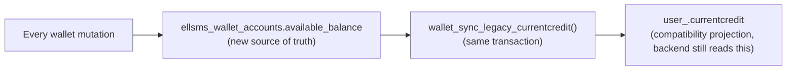
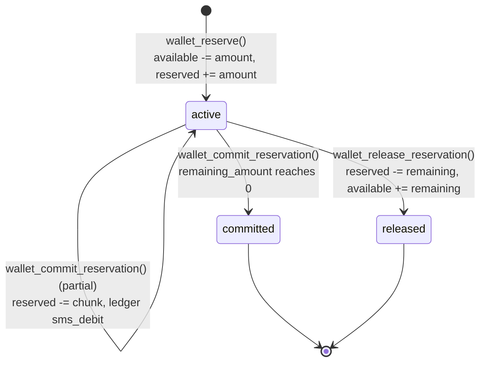
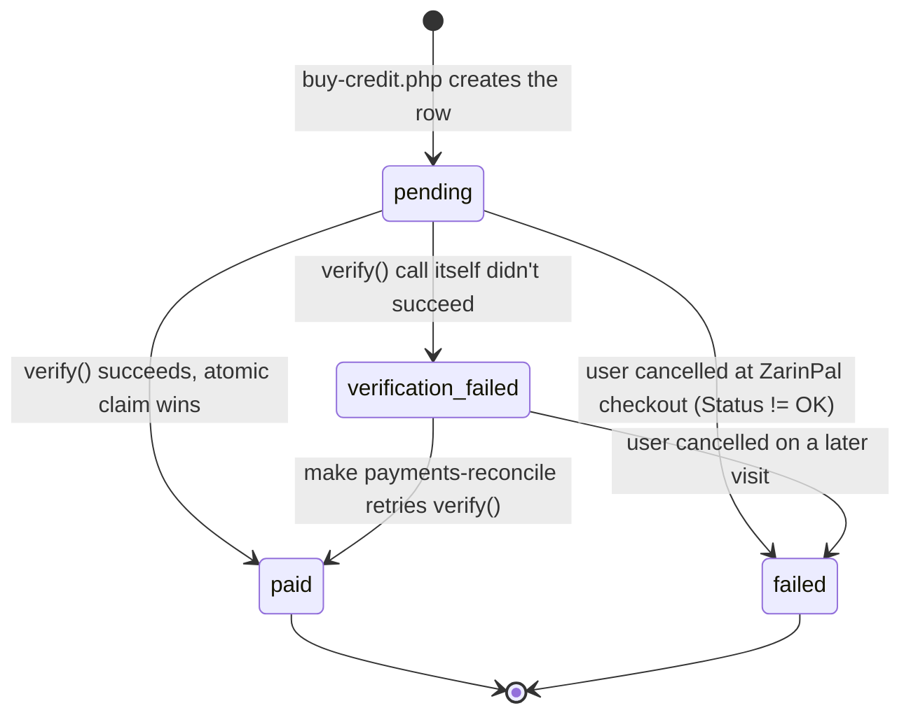

# ELLSMS — Wallet Architecture (Phase 3)

This document describes the wallet ledger/reservation system introduced in Phase 3 to fix the
financial-integrity gaps identified in Phase 1/2 (`docs/security-review.md` finding 6,
`docs/technical-debt.md` TD-003/TD-005/TD-006, `docs/flows/credit.md`). It replaces
"read `user_.currentcredit` → decide → write it later" with an append-only ledger, a reservation
model for accepted-but-not-yet-executed work, and database-level idempotency.

## Source of truth

**`ellsms_wallet_accounts` + `ellsms_wallet_transactions` are now the ELLSMS financial source of
truth. `user_.currentcredit` is a compatibility projection of `available_balance`, kept in lockstep
by every wallet mutation, in the same transaction.** No application code outside `app/wallet.php`
writes to `currentcredit` anymore (verified: a repo-wide search for `SET currentcredit` finds
exactly the one call inside `wallet_sync_legacy_currentcredit()`). The backend platform still reads
`currentcredit` directly and continues to see an accurate, real-time spendable balance — nothing
about that integration changed from its perspective.

## Ledger model

`ellsms_wallet_transactions` is append-only — no application code updates or deletes a row here
(Invariant B/corrections use compensating entries, STEP 20). Each row records `type`, a signed
`amount` (+credit / -debit), `balance_before`/`balance_after` (both track `available_balance`,
never `reserved_balance` — see the reservation section for why), a `reference_type`/`reference_id`
identifying the business object, and a globally-`UNIQUE idempotency_key` — the actual mechanism
that makes a retried operation a safe no-op (Invariant C/F).

| type | Written by |
|---|---|
| `purchase` | `payment_claim_and_credit()` (a completed ZarinPal payment) |
| `sms_debit` | `wallet_commit_reservation()` (spending part/all of a reservation) or `wallet_debit()` directly |
| `manual_credit` / `manual_debit` | `wallet_manual_adjustment()` (admin credit/debit, STEP 17) |
| `reservation_release` | `wallet_release_reservation()` (unused reserved credit returned) |
| `migration_opening_balance` | `wallet_backfill_user()` (STEP 4, one row per user, once) |

## Idempotency — how it actually works

Every mutating function in `app/wallet.php` follows the same pattern: **lock the relevant row
(`SELECT ... FOR UPDATE`) first, THEN check whether this exact operation was already recorded, and
only mutate anything if it wasn't.** This is deliberately not "insert first, catch a duplicate-key
exception" — that pattern only rolls back cleanly when the function owns its own top-level
transaction. `bulk_queue_job()` and `payment_claim_and_credit()` both call these functions from
*within* their own already-open `db_transaction()` closures, and MySQL does not roll back an entire
transaction just because one nested statement hit a UNIQUE constraint — only an explicit `ROLLBACK`
does, and `db_transaction()`'s reentrancy check correctly defers that to whichever caller opened
the transaction first. Locking before checking closes the race for genuinely concurrent top-level
callers (the second blocks on the lock until the first commits, then sees the row and returns the
replay result) while also being correct for a same-transaction retry — this was found and fixed
during Phase 3's own test-writing (see `tests/Integration/WalletIntegrationTest.php`).

## Reservation lifecycle

A reservation ends as exactly one of `committed` or `released`, never both (Invariant E) —
`wallet_release_reservation()` on an already-`committed` row is a no-op (nothing left to give back);
`wallet_commit_reservation()` requires `status = 'active'`. At most one reservation can ever exist
per `(reference_type, reference_id)` — a retried "accept this job" replays the same reservation
instead of creating a second one (Invariant D).

**Important accounting detail**: committing a reservation moves money out of `reserved_balance`,
*not* `available_balance` — that credit already left "available" the moment it was reserved. The
ledger's `balance_before`/`balance_after` for a `sms_debit` committed against a reservation are
therefore equal (both reflect `available_balance`, unchanged by the commit) — the real effect is
visible in `reserved_balance` and in the row's own `amount`. This is intentional, not a bug: it
keeps every ledger row's `balance_before`/`balance_after` consistently meaning "what
`currentcredit` showed," rather than sometimes meaning one thing and sometimes another.

## Financial flows

### Direct send / scheduled send / auto-reply / 2FA (`dispatch_message()`)

`dispatch_message()` (`app/backend.php`) is the shared wrapper used by everything except bulk:
**reserve the worst-case cost → call `dispatch_message_raw()` (the actual gateway call, credit-free)
→ commit exactly what was actually sent → release whatever wasn't** (STEP 11). This closes the old
check-then-deduct race (`docs/flows/credit.md`) — the reservation's row lock means a concurrent
duplicate/parallel send against the same account can no longer both pass a credit check and both
spend.

- **Scheduled sends** use `schedule:{scheduleId}:{run_count}` as the wallet reference — not just the
  schedule row's own id, since a *recurring* schedule reuses the same row for every occurrence;
  without `run_count`, every future occurrence would collide with the first occurrence's
  reservation (found and fixed during implementation).
- **Auto-reply** uses the already-claimed `ellsms_autoreply_log` row id as the reference — that
  claim (a `UNIQUE` key on `inbound_message_id`) already exists specifically to prevent duplicate
  replies, so reusing it for the wallet reference means a retried inbound row can't double-charge
  either.
- **Direct/API sends** have no natural durable reference id, so one is derived deterministically
  from the request itself (`user + originator + destinations + content`, 10-second bucket) — this
  absorbs the realistic accidental-duplicate case (double-click, browser "back" + resubmit) without
  a larger UI change (a client-side idempotency token on every send form was judged out of
  proportion for a CSRF-protected, interactively-submitted form). **It deliberately does not**
  protect against a resubmitted HTTP request that lands more than 10 seconds later, nor against
  application-level retry logic re-entering `dispatch_message()` after a mid-flight crash between
  a successful gateway send and this function's own commit step — the backend gateway itself has no
  idempotency key of its own, so a crash in that exact window could in principle result in a
  duplicate SMS being sent even though the *financial* side stays exactly-once. This is an honest,
  documented boundary (per STEP 11's own instruction not to pretend stronger delivery guarantees
  exist than the backend actually provides), not a gap Phase 3 claims to close.

### Bulk send (`bulk_queue_job()` / `bulk_send_one_item()` / `run_bulk_send_pass()`)

Unlike the flows above, a bulk job's *entire* worst-case cost is reserved **once**, atomically, in
the same transaction as creating the job + item rows (STEP 9) — an unfunded-looking job can never
exist. `bulk_send_one_item()` calls `dispatch_message_raw()` directly (not `dispatch_message()`) and
commits each item's actual cost against that one job-level reservation, keyed by the item's own id
(so a worker retry of one row after a crash can't double-charge). `run_bulk_send_pass()` releases
whatever's left of a job's reservation the moment the job finishes (STEP 9's "do not silently
strand reserved funds"); cancelling a job (`p2p-send.php`/`smart-send.php`) does the same.

### Payments (`payment_claim_and_credit()`)

The payment-row claim (`UPDATE ... WHERE status IN ('pending','verification_failed')`) and the
wallet credit now happen inside **one** transaction (STEP 13) — previously these were two separate,
independently-autocommitted statements, so a crash between them could leave a payment permanently
`paid` with the customer never actually credited (the exact HIGH finding this closes). Both
`public/zarinpal-callback.php` (a live browser return) and `cron/payments-reconcile.php` (STEP 15)
call the same function, so the atomicity/idempotency guarantee only had to be gotten right once.

**Payment state machine** (STEP 14) splits the old single `failed` status:

`failed` reflects the user's own action at checkout — a real, final outcome.
`verification_failed` reflects the `zarinpal_verify()` call itself not succeeding (network error,
ZarinPal API error, or a non-100/101 code), which may be transient — kept retryable rather than
treated as a permanent dead end.

### Payment reconciliation (`cron/payments-reconcile.php`)

Recovers two cases documented as unrecovered gaps in `docs/flows/payment.md`: rows stuck
`verification_failed`, and rows stuck `pending` older than `PAYMENT_RECONCILE_STALE_MINUTES`-worth
of time (default 15 minutes via `--stale-minutes=N`) — the user paid but the browser never returned
to the callback URL at all. Manual/on-demand in this phase (`make payments-reconcile`), not a
scheduler — idempotent and safe to run repeatedly or concurrently with a live callback, since both
paths go through the same atomic `payment_claim_and_credit()`.

### Admin manual credit adjustment (`wallet_manual_adjustment()`)

Requires a non-empty `$reason` (STEP 17) — `public/users.php`'s credit form gained an optional
"reason" text field that defaults to a generic Persian string if left blank, so this doesn't
silently break the existing UX. A debit larger than the available balance **clamps at zero** rather
than being rejected, matching the pre-Phase-3 `GREATEST(0, currentcredit + amount)` behavior
exactly — there is no supported administrative-debt model, and rejecting outright would be a
breaking behavior change for a legitimate "zero out this account" admin action.

### Refund / compensation

No dedicated "refund" function was built — `wallet_credit(userId, amount, 'refund', refType, refId,
idempotencyKey, actorId, metadata)` already covers it (an auditable, append-only ledger credit,
never editing/deleting the original debit it's compensating for). This phase did not build an
automated provider-money-refund flow (STEP 16 explicitly doesn't require that); it built the wallet
primitive a future refund UI would call.

## Backfill (STEP 4)

`cron/wallet-backfill.php` (`make wallet-backfill`, or `make wallet-backfill-dry-run` to preview)
creates an `ellsms_wallet_accounts` row for every ELLSMS-managed user who doesn't have one yet,
seeded from their **current** `user_.currentcredit` — never reset, never double-credited. Each new
account gets exactly one `migration_opening_balance` ledger row. Idempotent: a user who already has
a wallet account is skipped entirely on a re-run (e.g. for accounts granted access after the first
run). Not automatic — no request path or container startup calls it.

## Drift detection (STEP 19)

`cron/wallet-audit.php` (`make wallet-audit`) compares every wallet account's `available_balance`
against `user_.currentcredit` and reports any mismatch. Read-only; never auto-corrects — drift must
be visible and investigated by a human before anything is changed. A non-empty report means either
a bug in `app/wallet.php`, or something outside it wrote to `currentcredit` directly (which
shouldn't be possible after this phase, but the check exists precisely so that assumption doesn't
go unverified). Exit code 1 if drift is found, so it doubles as a CI/monitoring check.

## Operational visibility (STEP 24)

No new dashboard was built (out of scope for this phase). Everything below is already observable
through the existing `Logger` infrastructure (`storage/logs/`, or `docker compose logs` for
CLI-run commands) without any new tooling:

- **Payment reconciliation failures** — `payments.reconcile.still_unverified`, `.row_failed`.
- **Wallet drift** — run `make wallet-audit`; also logs `wallet.audit.finished` with a count.
- **Reservation failures due to insufficient balance** — `wallet.reservation.insufficient_balance`.
- **Stale active reservations** — query `ellsms_wallet_reservations WHERE status='active' AND
  created_at < ...`; no dedicated report script was built for this specifically, since
  `wallet-audit`'s drift check and the reservation table's own `expires_at`/`status` columns already
  make this directly queryable.
- **Duplicate/idempotency conflict attempts** — every replay logs nothing extra by design (a replay
  is a *successful*, expected outcome, not an error — logging it as a warning would create noise for
  normal retry behavior); the underlying event that triggered the retry (e.g.
  `auth.login.rate_limited`, `payments.reconcile.already_claimed`) is what's logged instead.

## Deployment order

1. Review then apply schema migrations: `make db-migrations-show`, then `make db-migrations-apply`
   (adds `ellsms_wallet_accounts`, `ellsms_wallet_transactions`, `ellsms_wallet_reservations`, and
   widens `ellsms_payments.status` — see `db/migrations/README.md`).
2. Run the backfill: `make wallet-backfill-dry-run` to preview, then `make wallet-backfill`.
3. Run `make wallet-audit` — expect zero drift immediately after backfill; investigate before
   proceeding if not.
4. Deploy the application/worker images (this phase's code changes).
5. Monitor: `make wallet-audit` periodically, and `make payments-reconcile-dry-run` /
   `make payments-reconcile` for any payments that need recovering (existing `pending`/`failed` rows
   from before this phase are untouched — reconciliation only acts on `pending`/`verification_failed`
   rows going forward).

**Nothing above runs automatically.** No migration, backfill, or reconciliation is triggered by
`docker/entrypoint.sh`, container startup, or any request path — every step is an explicit operator
action, per this phase's own ground rules.

## Rollback considerations

- Reverting this phase's application code is safe on its own: nothing pre-Phase-3 reads the new
  wallet tables, and `user_.currentcredit` remains fully populated and accurate throughout (it's
  kept synchronized, not replaced).
- The `ellsms_payments.status` ENUM widening (`verification_failed`) is additive; rolling back the
  application code to a version that doesn't know about that status would treat existing
  `verification_failed` rows as an unrecognized status value in ENUM comparisons — practically, such
  rows just wouldn't match any `WHERE status = 'pending'`-style clause in the old code, meaning they'd
  sit inert rather than error. Re-verifying them via a fresh `buy-credit.php` purchase remains
  available regardless.
- No down-migration tooling exists in this codebase (consistent with `db/ellsms_extra.sql` and every
  Phase 2 migration) — a full schema rollback would mean manually dropping the three new wallet
  tables, which is safe since nothing outside `app/wallet.php` reads them.
